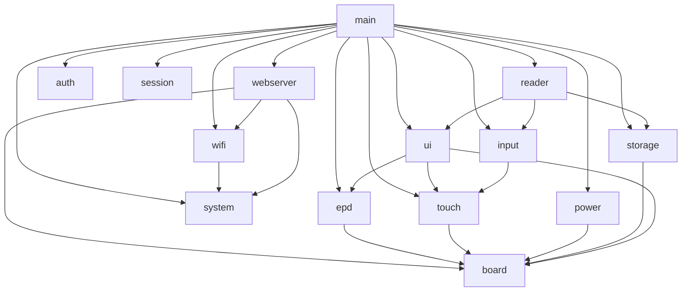

# ESPaperPlay

> An open-source e-paper device development platform built on **ESP32-S3**.
>
> 基于 **ESP32-S3** 的开源电子纸设备开发平台。

<p align="center">
  <a href="#en">English</a> · <a href="#zh">简体中文</a>
</p>

---

<a id="en"></a>
## English

ESPaperPlay is an embedded software platform for low-power e-paper applications. The first milestone is a low-power e-reader built around an **ESP32-S3 + 7.5-inch e-ink display**, while keeping clear extension points for e-book readers, desktop info panels, smart calendars, Home Assistant status screens, e-labels, and more.

The repository is under active development: a modular, maintainable, and extensible architecture is in place. Board drivers (UC8179 EPD, GT911 touch), system config (NVS), WiFi (AP/STA), and a Web management console are already implemented; EPUB/PDF parsing and the LVGL UI are planned for later phases.

### Hardware Platform

| Module  | Model                   | Description                                    |
| ------- | ----------------------- | ---------------------------------------------- |
| MCU     | ESP32-S3-WROOM-1-N16R8  | 16MB Flash, 8MB PSRAM                         |
| Display | Good Display GDEY075T7-T01 | 7.5", 800x480, UC8179 controller, SPI      |
| Touch   | GT911                   | Capacitive touch, I2C + INT + RESET            |
| Storage | MicroSD                 | EPUB / TXT / images / config files             |
| Power   | Low-power design        | ESP32 sleep, external wake-up, peripheral power-off control |

Default GPIO and bus parameters are defined centrally in
`components/board/include/espaperplay_config.h`.

### Software Architecture

#### Directory Structure

```
ESPaperPlay
├── main/                  # System entry: init modules + create tasks (no business logic)
└── components/
    ├── board/             # Board-level HW abstraction: GPIO/SPI/I2C config & peripheral init
    ├── drivers/           # Peripheral driver layer
    │   ├── epd/           # E-paper driver (GDEY075T7-T01 / UC8179: full/partial/gray4/fast)
    │   └── touch/         # GT911 touch abstraction
    ├── services/          # System service layer
    │   ├── auth/          # Device auth: secure password storage & verification
    │   ├── input/         # Input event management: touch + physical buttons
    │   ├── power/         # Power management: sleep / wakeup / power domains
    │   ├── storage/       # Storage abstraction: SD card + file system
    │   ├── system/        # System config: WiFi mode & credentials persisted to NVS
    │   ├── session/       # Session mgmt: login state, token & rate limiting
    │   ├── wifi/          # WiFi service: AP / STA networking per system config
    │   └── webserver/     # Web console: view status & change settings (esp_https_server)
    ├── graphics/          # Graphics / UI layer
    │   └── ui/            # GUI backend (RGB565 framebuffer + mode converters)
    └── applications/      # Application layer
        └── reader/        # Reader core framework (TXT/EPUB/PDF to come)
```

#### Layered Dependencies



- `board` is the lowest-level hardware abstraction, providing pin and bus configuration upward;
- `drivers` holds peripheral driver abstractions (epd / touch), while `services` holds system services (auth / input / power / storage / system / session / wifi / webserver);
- `graphics/ui` and `applications/reader` belong to the application-layer framework and reserve interfaces for future features;
- Modules communicate only through public APIs (`espaperplay_xxx()`); direct access to internal variables is prohibited.

#### EPD Driver (GDEY075T7-T01 / UC8179)

The e-paper driver uses a differential (NEW/OLD plane) architecture: the CDI
`N2OCP` bit makes the controller auto-copy the new plane into the old plane
after every refresh, so no software frame-tracking is needed and partial
updates work on any background. Four refresh modes are exposed through
`espaperplay_epd_refresh()`:

| Mode | Frame format | Notes | Measured (room temp) |
| ---- | ------------ | ----- | -------------------- |
| `FULL` | 1 bpp, 48000 B | OTP fast waveform (force temp 0x5A) | ~1.7 s |
| `PARTIAL` | 1 bpp window (x / width 8-aligned) | PTOUT after DRF (vendor order) | ~0.37 s (80x80), ~0.52 s (full window) |
| `GRAY4` | 2 bpp, 96000 B (0=white ... 3=black) | factory 4-gray waveform, full screen only | — |
| `FAST` | 1 bpp, 48000 B | same waveform as FULL (PLL has no effect on this panel) | ~1.7 s |

Timings are end-to-end `espaperplay_epd_refresh()` durations including
controller (re)initialization; consecutive refreshes in the same mode skip the
re-init, and the driver deep-sleeps the panel automatically when no refresh
arrives for `ESPAPERPLAY_EPD_IDLE_SLEEP_TIMEOUT_MS` (default 30 s, 0 to
disable; refresh always re-initializes on wake). A boot self-test
(`ESPAPERPLAY_EPD_ENABLE_SELFTEST`, off by default) exercises every mode,
prints timings, clears the panel to white and sleeps.

#### GUI Backend (RGB565 + Mode Converters)

The GUI service (`components/graphics/ui`) provides the rendering backend: a
single **RGB565 main framebuffer** (750 KB, PSRAM) is the render target (LVGL
later renders directly into it with `LV_COLOR_DEPTH=16`), and the e-paper's
1bpp / 2bpp constraints are confined to a conversion stage at flush time:

| Mode | Conversion | Refresh |
| ---- | ---------- | ------- |
| Interactive (`BW`) | RGB -> 1bpp: fast threshold or Bayer 4x4 (default; pure black/white bit-exact, no artifacts) | dirty-area partial, ~0.37-0.52 s |
| High-definition (`GRAY4`) | RGB -> 2bpp: Floyd-Steinberg error diffusion (default) or Bayer 4x4 | full screen, ~2.5 s |

Dirty areas are clipped, 8-pixel aligned (X) and merged into one refresh per
frame. Refreshes run **asynchronously on an internal worker task**: flush()
only snapshots (converts) the dirty area and queues it, so renderers (LVGL)
are never blocked by the ~0.4-2.6 s panel update; up to one frame is queued
ahead and later frames merge into it. `espaperplay_gui_wait_idle()` provides
an optional sync point. Page-level switches (`espaperplay_gui_show_ui` /
`show_image`) only change the conversion path — the framebuffer is never
re-rendered — and the driver guarantees clean transitions (gray4 -> BW inverts
the old plane, so residual mid-grays are erased). A self-test
(`ESPAPERPLAY_GUI_ENABLE_SELFTEST`, off by default) exercises both paths and
prints conversion and worker timings.

#### Naming & Logging Conventions

- All public APIs use the `espaperplay_<module>_<action>()` prefix;
- Log tags follow `ESPaperPlay_<MODULE>`, e.g. `ESPaperPlay_EPD`, `ESPaperPlay_POWER`;
- Use `ESP_LOGI / ESP_LOGW / ESP_LOGE`;
- All public functions are documented with Doxygen comments.

#### Web Console

After boot, a management page is served over **HTTPS** on port **443** of every
network interface (reachable in both AP and STA modes). Plain **HTTP on port
80** is still listened to, but only redirects every request to HTTPS (no
plaintext traffic). The device generates its own P-256 self-signed certificate
on first boot (persisted in NVS, fingerprint stays stable across reboots); the
private key never leaves the device, so it cannot be extracted from the firmware.

| Route                | Method | Description                                       |
| -------------------- | ------ | ------------------------------------------------- |
| `/`                  | GET    | Management page (embedded HTML)                   |
| `/api/status`        | GET    | Runtime status: uptime / heap / firmware / WiFi (auth) |
| `/api/config`        | GET    | Current system config: WiFi mode & credentials (auth) |
| `/api/config`        | POST   | Update config (form-encoded), save & re-apply WiFi (auth) |
| `/api/config/reset`  | POST   | Restore factory defaults & re-apply WiFi (auth)   |
| `/api/wifi/restart`  | POST   | Re-apply WiFi config (auth)                       |
| `/api/system/reboot` | POST   | Reboot the device (auth)                          |
| `/api/auth/status`   | GET    | Login state: authenticated / password configured  |
| `/api/auth/login`    | POST   | Password login, returns a session token           |
| `/api/auth/password` | POST   | Set (first-time) or change password (auth if set) |
| `/api/auth/logout`   | POST   | Revoke the current session                        |

> AP mode: connect to the device AP from a phone / laptop and browse to
> `http://192.168.4.1/` (it redirects to `https://192.168.4.1/`). Your browser
> will warn about the self-signed certificate — accept the security exception
> once; the certificate SHA-256 fingerprint is printed in the serial log so you
> can verify the connection. On first boot (no password configured yet) the
> console guides you to set a password; afterwards login is required.
> Sensitive APIs (config / wifi / reboot / status) are protected by a bearer
> session token; 5 consecutive login failures trigger a temporary lockout.

### Building

#### Requirements

- ESP-IDF **v6.0.2** (target chip: ESP32-S3)
- CMake ≥ 3.22
- Note: this repo vendors no third-party libraries and does not modify the ESP-IDF version.

#### Build

```bash
# 1. Load the ESP-IDF environment
. $HOME/esp/esp-idf/export.sh        # adjust the path to your installation

# 2. Set the target chip (first time or when switching chips)
idf.py set-target esp32s3

# 3. Build
idf.py build

# 4. Flash and monitor
idf.py -p /dev/ttyUSB0 flash monitor
```

On a fresh clone, `sdkconfig.defaults` (16MB Flash / 8MB PSRAM) is applied automatically; adjust via `idf.py menuconfig` if needed.

#### CI

GitHub Actions runs `idf.py build` automatically in `.github/workflows/build.yml` (using the `espressif/idf:v6.0.2` container) to keep every commit compilable.

### Roadmap

- [x] **Phase 0**: software architecture bootstrap, module skeletons, build system & CI
- [x] **Phase 1**: Board drivers (GPIO / SPI / I2C bus init)
- [x] **Phase 2**: EPD (UC8179) driver & refresh (full / partial / gray4 / fast), GT911 touch driver
- [ ] **Phase 3**: Low-power power management (sleep / wake-up / power domains)
- [ ] **Phase 4**: SD card + FATFS file system
- [ ] **Phase 5**: LVGL UI framework
- [ ] **Phase 6**: Reader (TXT → EPUB → PDF)
- [ ] **Phase 7**: Networking & IoT features (optional)
  - [x] Web management console (HTTPS): esp_https_server status & settings

### License

This project is open-sourced under the [MIT License](LICENSE).

---

<a id="zh"></a>
## 简体中文

ESPaperPlay 是一个面向低功耗电子纸应用的嵌入式软件平台。第一阶段目标是
开发一款基于 **ESP32-S3 + 7.5 英寸电子墨水屏** 的低功耗阅读器，同时为
电子书阅读器、桌面信息屏、智能日历、Home Assistant 状态屏、电子标签等
应用预留清晰的扩展点。

当前仓库处于 **积极开发阶段**：已建立模块化、可维护、可扩展的软件架构。
Board 驱动（UC8179 电子纸、GT911 触摸）、系统配置（NVS）、WiFi（AP/STA）
与 Web 管理控制台均已实现；EPUB/PDF 解析与 LVGL 界面将在后续阶段接入。

### 硬件平台

| 模块        | 型号                 | 说明                                    |
| ----------- | -------------------- | --------------------------------------- |
| MCU         | ESP32-S3-WROOM-1-N16R8 | Flash 16MB，PSRAM 8MB                  |
| 显示屏      | 佳显 GDEY075T7-T01   | 7.5"，800x480，UC8179 控制器，SPI 接口  |
| 触摸屏      | GT911                | 电容触摸，I2C + INT + RESET             |
| 存储        | MicroSD              | EPUB / TXT / 图片 / 配置文件             |
| 电源        | 低功耗设计            | ESP32 sleep、外部唤醒、外设断电控制     |

GPIO 与总线默认参数统一在 `components/board/include/espaperplay_config.h`
中定义。

### 软件架构

#### 目录结构

```
ESPaperPlay
├── main/                  # 系统入口：初始化各模块 + 创建任务（无业务逻辑）
└── components/
    ├── board/             # Board 级硬件抽象：GPIO/SPI/I2C 配置与外设初始化
    ├── drivers/           # 外设驱动层
    │   ├── epd/           # 电子纸驱动（GDEY075T7-T01 / UC8179：全刷/局刷/灰阶/快刷）
    │   └── touch/         # GT911 触摸抽象层
    ├── services/          # 系统服务层
    │   ├── auth/          # 设备鉴权：密码安全存储 / 校验 / 更改
    │   ├── input/         # 输入事件管理：触摸 + 物理按键
    │   ├── power/         # 电源管理：sleep / wakeup / 电源域控制
    │   ├── storage/       # 存储抽象：SD 卡 + 文件系统
    │   ├── system/        # 系统配置：WiFi 模式与凭据持久化到 NVS
    │   ├── session/       # 会话管理：登录态、token 与失败限速锁定
    │   ├── wifi/          # WiFi 服务：按系统配置启动 AP / STA 网络
    │   └── webserver/     # Web 管理：状态查看与设置修改（esp_https_server）
    ├── graphics/          # 图形 / 界面层
    │   └── ui/            # GUI 渲染后端（RGB565 帧缓冲 + 模式转换级）
    └── applications/      # 应用层
        └── reader/        # 阅读器核心框架（未来支持 TXT/EPUB/PDF）
```

#### 分层依赖


- `board` 为最底层硬件抽象，向上提供引脚与总线配置；
- `drivers` 承载外设驱动抽象（epd / touch），`services` 承载系统服务（auth / input / power / storage / system / session / wifi / webserver）；
- `graphics/ui` 与 `applications/reader` 属于应用层框架，为后续业务预留接口；
- 模块之间仅通过公共 API（`espaperplay_xxx()`）通信，禁止直接访问内部变量。

#### EPD 驱动（GDEY075T7-T01 / UC8179）

电子纸驱动采用差分（新旧平面）架构：CDI 的 `N2OCP` 位使控制器在每次
刷新完成后自动把新平面拷贝到旧平面，无需软件维护"上一帧"，局部刷新可
在任意背景上工作。`espaperplay_epd_refresh()` 提供四种刷新模式：

| 模式 | 帧格式 | 说明 | 实测（室温） |
| ---- | ------ | ---- | ------------ |
| `FULL` | 1bpp 48000B | OTP 快刷波形（强制温度 0x5A） | ~1.7s |
| `PARTIAL` | 1bpp 窗口（x/width 8 对齐） | PTOUT 在 DRF 后（厂商顺序） | ~0.37s（80x80）/ ~0.52s（全屏窗口） |
| `GRAY4` | 2bpp 96000B（0=白…3=黑） | 出厂四灰阶波形，仅全屏 | — |
| `FAST` | 1bpp 48000B | 与 FULL 同波形（PLL 对本面板无效） | ~1.7s |

耗时为 `espaperplay_epd_refresh()` 端到端时长（含控制器初始化）；同模式
连续刷新会跳过重复初始化；驱动在最后一次刷新后超过
`ESPAPERPLAY_EPD_IDLE_SLEEP_TIMEOUT_MS`（默认 30s，0 关闭）无新刷新时
自动深度睡眠（保底，刷新会自动唤醒）。上电自检
（`ESPAPERPLAY_EPD_ENABLE_SELFTEST`，默认关闭）可复验各模式并打印耗时。

#### GUI 渲染后端（RGB565 + 模式转换级）

GUI 服务（`components/graphics/ui`）提供渲染后端：单一 **RGB565 主帧缓冲**
（750KB，PSRAM）作为渲染目标（后续 LVGL 以 `LV_COLOR_DEPTH=16` 直接画入），
电子纸的 1bpp/2bpp 限制全部收敛到 flush 时的转换级：

| 模式 | 转换 | 刷新 |
| ---- | ---- | ---- |
| 交互（`BW`） | RGB->1bpp：快速阈值 或 Bayer 4x4（默认；纯黑/纯白位精确，无伪影） | 脏区局部，~0.37-0.52s |
| 高清（`GRAY4`） | RGB->2bpp：Floyd-Steinberg 误差扩散（默认）或 Bayer 4x4 | 全屏，~2.5s |

脏区自动裁剪、X 方向 8 像素对齐并合并为一帧一次刷新。刷新**异步化**：
flush() 只把脏区快照转换后排队，真实刷新由内部 worker 任务执行（约
0.4-2.6s 的面板更新不阻塞渲染器/LVGL）；最多一帧排队，后续帧合并进待刷帧；
`espaperplay_gui_wait_idle()` 提供可选同步点。页面级切换
（`espaperplay_gui_show_ui` / `show_image`）只改变转换路径、不重渲染主帧；
驱动保证切换刷新干净（灰阶->黑白反相旧平面，清除中间灰残留）。自检
（`ESPAPERPLAY_GUI_ENABLE_SELFTEST`，默认关闭）覆盖两条路径并打印转换与
worker 刷新耗时。

#### 命名与日志规范

- 所有公开 API 统一使用 `espaperplay_<模块>_<动作>()` 前缀；
- 日志 TAG 统一为 `ESPaperPlay_<MODULE>`，例如 `ESPaperPlay_EPD`、
  `ESPaperPlay_POWER`；
- 使用 `ESP_LOGI / ESP_LOGW / ESP_LOGE`；
- 所有公共函数带有 Doxygen 注释。

#### Web 管理控制台

设备启动后会在**所有网络接口的 443 端口**以 **HTTPS** 提供管理页面（AP 与
STA 模式下均可访问）。**80 端口**仍会监听，但仅把所有请求 302 重定向到
HTTPS，杜绝明文流量。设备在首次启动时自行生成 P-256 自签名证书（持久化于
NVS，重启后指纹不变），私钥永不出设备，无法从固件中提取。

| 路由                  | 方法  | 说明                                        |
| --------------------- | ----- | ------------------------------------------- |
| `/`                   | GET   | 管理页面（嵌入式 HTML）                     |
| `/api/status`         | GET   | 运行状态：运行时间 / 堆 / 固件 / WiFi 等（需登录）|
| `/api/config`         | GET   | 当前系统配置：WiFi 模式与凭据（需登录）           |
| `/api/config`         | POST  | 更新配置（表单编码），保存并重新应用 WiFi（需登录）|
| `/api/config/reset`   | POST  | 恢复出厂默认配置并重新应用 WiFi（需登录）         |
| `/api/wifi/restart`   | POST  | 重新应用 WiFi 配置（需登录）                      |
| `/api/system/reboot`  | POST  | 重启设备（需登录）                                |
| `/api/auth/status`    | GET   | 登录状态：是否已登录 / 是否已设置密码              |
| `/api/auth/login`     | POST  | 密码登录，成功后返回会话 token                    |
| `/api/auth/password`  | POST  | 首次设置 / 修改密码（已设置后需登录）              |
| `/api/auth/logout`    | POST  | 吊销当前会话                                      |

> AP 模式下用手机 / 电脑连接设备热点，浏览器访问 `http://192.168.4.1/`
>（会自动重定向到 `https://192.168.4.1/`）。浏览器会对自签名证书给出安全
> 警告，首次访问需手动信任一次；证书 SHA-256 指纹会打印在串口日志中，可据
> 此核对连接真实性。设备出厂未设置密码时，页面会引导首次设置密码；
> 设置后访问需登录。
> 配置 / WiFi / 重启 / 状态等敏感接口由会话 token 鉴权保护，连续 5 次登录
> 失败会触发临时锁定。

### 编译方法

#### 环境要求

- ESP-IDF **v6.0.2**（目标芯片 ESP32-S3）
- CMake ≥ 3.22
- 说明：本仓库不安装第三方库，不修改 ESP-IDF 版本。

#### 编译

```bash
# 1. 加载 ESP-IDF 环境
. $HOME/esp/esp-idf/export.sh        # 路径以实际安装为准

# 2. 设置目标芯片（首次或切换芯片时）
idf.py set-target esp32s3

# 3. 编译
idf.py build

# 4. 烧录并查看日志
idf.py -p /dev/ttyUSB0 flash monitor
```

首次克隆时，`sdkconfig.defaults`（Flash 16MB / PSRAM 8MB）会自动生效；
如需调整请使用 `idf.py menuconfig`。

#### CI

GitHub Actions 在 `.github/workflows/build.yml` 中自动执行 `idf.py build`
（使用 `espressif/idf:v6.0.2` 容器），确保每次提交可编译。

### 开发路线

- [x] **Phase 0**：软件架构初始化、模块骨架、构建系统与 CI
- [x] **Phase 1**：Board 驱动（GPIO / SPI / I2C 总线初始化）
- [x] **Phase 2**：EPD（UC8179）驱动与刷新（全刷/局刷/灰阶/快刷）、GT911 触摸驱动
- [ ] **Phase 3**：低功耗电源管理（sleep / 唤醒 / 电源域）
- [ ] **Phase 4**：SD 卡 + FATFS 文件系统
- [ ] **Phase 5**：LVGL 界面框架
- [ ] **Phase 6**：阅读器（TXT → EPUB → PDF）
- [ ] **Phase 7**：网络与物联网功能（可选）
  - [x] Web 管理控制台（HTTPS）：esp_https_server 状态查看与设置

### License

本项目基于 [MIT License](LICENSE) 开源。
