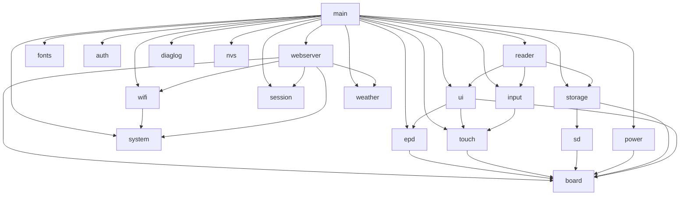

# ESPaperPlay

> An open-source e-paper device development platform built on **ESP32-S3**.
>
> 基于 **ESP32-S3** 的开源电子纸设备开发平台。

<p align="center">
  <a href="#en">English</a> · <a href="#zh">简体中文</a>
</p>

---

<a id="en"></a>
## English

ESPaperPlay is an embedded software platform for low-power e-paper applications. The first milestone — a low-power e-reader built around an **ESP32-S3 + 7.5-inch e-ink display** — now works end to end: TXT/EPUB reading, a weather station screen, on-device file management, a first-boot setup wizard, an HTTPS Web management console, and an activity-aware auto-light-sleep power system. The architecture keeps clear extension points for desktop info panels, smart calendars, Home Assistant status screens, e-labels, and more.

The repository is under active development with a modular, maintainable, and extensible architecture. See [CHANGELOG.md](CHANGELOG.md) for release history.

### Feature Overview

- **E-paper driver** — full / partial / 4-gray / fast refresh modes, async refresh worker, anti-ghosting (see below)
- **Launcher desktop (LVGL 9)** — status bar, clock page, app cards (Weather / Reader / Files / Settings), page-stack navigation, gesture + physical key input, multi-resolution layouts (portrait / landscape)
- **E-reader** — TXT + EPUB 2/3: table of contents, page-number jump, font sizes, image pages with automatic gray-scale refresh, reading history & bookshelf, SD-backed pagination caches for instant re-opens
- **Weather station screen** — current conditions, 24 h temperature curve, 7-day dual-curve forecast, weather alerts, air quality & life indices, sun/moon arcs with the real moon-phase icon
- **File manager** — on-device browsing (TXT/EPUB open straight into the reader) + full Web file management (upload / download / mkdir / rename / delete)
- **Web management console (HTTPS)** — settings, WiFi scanning, font upload & selection, SD file manager, first-boot wizard, remote touch diagnostics, factory reset
- **Low power** — activity-aware auto light sleep, minute-aligned timer wakeup (weather refreshes even while asleep), software RTC drift calibration without an external 32k crystal
- **Reliability** — GT911 touch self-healing (auto recovery from the address-flip failure mode), SD diagnostic logging with a boot/sleep lifecycle timeline

### Hardware Platform

| Module  | Model                   | Description                                    |
| ------- | ----------------------- | ---------------------------------------------- |
| MCU     | ESP32-S3-WROOM-1-N16R8  | 16MB Flash, 8MB PSRAM                         |
| Display | Good Display GDEY075T7-T01 | 7.5", 800x480, UC8179 controller, SPI      |
| Touch   | GT911                   | Capacitive touch, I2C + INT + RESET            |
| Storage | MicroSD  | SDIO (SDMMC 4-bit), EPUB / TXT / images / config files |
| Power   | Low-power design        | Activity-aware auto light sleep, timer wakeup, software RTC drift calibration |

Default GPIO and bus parameters are defined centrally in
`components/board/include/espaperplay_config.h`.

### Software Architecture

#### Directory Structure

```
ESPaperPlay
├── main/                  # System entry: init modules + create tasks (no business logic)
├── assets/fonts/          # Font sources packed into the read-only fonts partition
├── tools/                 # Asset generators (font subsetting, Iconify/QWeather icons)
└── components/
    ├── board/             # Board-level HW abstraction: GPIO/SPI/I2C config & peripheral init
    ├── drivers/           # Peripheral driver layer
    │   ├── epd/           # E-paper driver (GDEY075T7-T01 / UC8179: full/partial/gray4/fast)
    │   ├── touch/         # GT911 touch abstraction + health self-healing
    │   └── sd/            # MicroSD driver (SDIO/SDMMC: host/slot/card + block I/O)
    ├── services/          # System service layer
    │   ├── auth/          # Device auth: secure password storage & verification
    │   ├── clock/         # System clock: timezone (persisted) + NTP sync
    │   ├── diaglog/       # SD diagnostic log: stack-safe writes + lifecycle timeline
    │   ├── geoip/         # IP geolocation via UAPI (uapis.cn), incl. timezone
    │   ├── input/         # Input event management: touch + physical buttons + activity tracking
    │   ├── netip/         # Public IP query via UAPI (uapis.cn)
    │   ├── nvs/           # NVS convenience wrapper (key-value persistence)
    │   ├── power/         # Power mgmt: auto light sleep / wakeup / periodic timer wake
    │   ├── session/       # Session mgmt: login state, token & rate limiting
    │   ├── storage/       # Storage abstraction: SD card + FATFS + VFS
    │   ├── system/        # System config persisted to NVS (WiFi / settings / font selection)
    │   ├── weather/       # QWeather client: now / 24h / 7d / minutely / alerts / indices / air / astronomy
    │   ├── wifi/          # WiFi service: AP / STA, network scanning, per system config
    │   └── webserver/     # Web console: status / settings / files / fonts / wizard (esp_https_server)
    ├── graphics/          # Graphics / UI layer
    │   ├── fonts/         # Font assets: fonts partition mmap (drive A:) + SD full font (drive B:)
    │   └── ui/            # LVGL backend (RGB565 framebuffer + mode converters) + status bar
    │       └── screens/   # boot / home / weather / reader / reader_home / files /
    │                      # settings / setup / wifi_list / test
    └── applications/      # Application layer
        ├── nettime/       # Net time app: public IP → geolocation → timezone → NTP
        └── reader/        # Reader: TXT/EPUB parsing, block model, pagination, history
            └── src/libs/  # Vendored TJpgDec (streaming JPEG decode for EPUB)
```

#### Layered Dependencies



- `board` is the lowest-level hardware abstraction, providing pin and bus configuration upward;
- `drivers` holds peripheral driver abstractions (epd / touch / sd), while `services` holds system services (auth / clock / diaglog / geoip / input / netip / nvs / power / session / storage / system / weather / wifi / webserver);
- `graphics/ui` and `applications/reader` belong to the application-layer framework;
- Modules communicate only through public APIs (`espaperplay_xxx()`); direct access to internal variables is prohibited.

#### EPD Driver (GDEY075T7-T01 / UC8179)

The e-paper driver uses a differential (NEW/OLD plane) architecture: the CDI
`N2OCP` bit makes the controller auto-copy the new plane into the old plane
after every refresh, so no software frame-tracking is needed and partial
updates work on any background. Four refresh modes are exposed through
`espaperplay_epd_refresh()`:

| Mode | Frame format | Notes | Measured (room temp) |
| ---- | ------------ | ----- | -------------------- |
| `FULL` | 1 bpp, 48000 B | OTP fast waveform (force temp 0x5A) | ~1.7 s |
| `PARTIAL` | 1 bpp window (x / width 8-aligned) | PTOUT after DRF (vendor order) | ~0.37 s (80x80), ~0.52 s (full window) |
| `GRAY4` | 2 bpp, 96000 B (0=white ... 3=black) | factory 4-gray waveform, full screen only | — |
| `FAST` | 1 bpp, 48000 B | same waveform as FULL (PLL has no effect on this panel) | ~1.7 s |

Timings are end-to-end `espaperplay_epd_refresh()` durations including
controller (re)initialization; consecutive refreshes in the same mode skip the
re-init, and the driver deep-sleeps the panel automatically when no refresh
arrives for `ESPAPERPLAY_EPD_IDLE_SLEEP_TIMEOUT_MS` (default 90 s, 0 to
disable; refresh always re-initializes on wake). A boot self-test
(`ESPAPERPLAY_EPD_ENABLE_SELFTEST`, off by default) exercises every mode,
prints timings, clears the panel to white and sleeps.

#### GUI Backend (RGB565 + Mode Converters)

The GUI service (`components/graphics/ui`) provides the rendering backend: a
single **RGB565 main framebuffer** (750 KB, PSRAM) is the render target (LVGL
renders directly into it with `LV_COLOR_DEPTH=16`), and the e-paper's
1bpp / 2bpp constraints are confined to a conversion stage at flush time:

| Mode | Conversion | Refresh |
| ---- | ---------- | ------- |
| Interactive (`BW`) | RGB -> 1bpp: fast threshold or Bayer 4x4 (default; pure black/white bit-exact, no artifacts) | dirty-area partial, ~0.37-0.52 s |
| High-definition (`GRAY4`) | RGB -> 2bpp: Floyd-Steinberg error diffusion (default) or Bayer 4x4 | full screen, ~2.5 s |

Dirty areas are clipped, 8-pixel aligned (X) and merged into one refresh per
frame. Refreshes run **asynchronously on an internal worker task**: flush()
only snapshots (converts) the dirty area and queues it, so renderers (LVGL)
are never blocked by the ~0.4-2.6 s panel update; up to one frame is queued
ahead and later frames merge into it. `espaperplay_gui_wait_idle()` provides
an optional sync point. Page-level switches (`espaperplay_gui_show_ui` /
`show_image`) only change the conversion path — the framebuffer is never
re-rendered — and the driver guarantees clean transitions (gray4 -> BW inverts
the old plane, so residual mid-grays are erased). A self-test
(`ESPAPERPLAY_GUI_ENABLE_SELFTEST`, off by default) exercises both paths and
prints conversion and worker timings.

**SPI transfer path**: the PSRAM-resident frame data is DMA-transferred to the
panel through a **persistent internal-RAM staging buffer** reserved at init
(the panel SPI does not reliably DMA from PSRAM — bounce buffers fragment the
internal heap and direct PSRAM DMA underflows under bus contention). Occasional
transfer failures are retried by the refresh worker with a short backoff.

Screen orientation defaults to **portrait (panel rotated 90° clockwise,
logical 480x800)**: rotation is applied pixel-wise inside the LVGL flush
callback (`lv_display_set_rotation` semantics — logical dirty areas are
mapped to physical ones via `lv_display_rotate_area`, touch coordinates are
rotated by the LVGL core), so the rest of the stack stays panel-native.
The test screen's double-click cycles through all four orientations; every
screen scales its layout to the current logical resolution (portrait and
landscape).

Launcher app icons are LVGL A8 bitmaps generated from
[Iconify](https://icon-sets.iconify.design/) SVGs (mdi set) by
`tools/fonttools-venv/bin/python tools/prepare_icons.py` (downloads the SVG,
rasterizes with ImageMagick, emits `components/graphics/ui/src/icons_data.c`
+ `include/icons_data.h`); cards render icon + FreeType label below.

Weather support includes the official **QWeather icon set**
([icons.qweather.com](https://icons.qweather.com/), package
`QWeather-Icons-1.8.0/`, MIT): `tools/fonttools-venv/bin/python
tools/prepare_qweather_icons.py` converts the API icon codes (day/night,
rain/snow/fog variants) into LVGL A8 bitmaps
(`components/graphics/ui/src/qweather_icons.c`, lookup
`qweather_icon_get(code)`). The weather app icon on the home screen shows the
**live weather icon** from the latest snapshot (falls back to the mdi icon
when weather is unavailable or the code is unknown).

#### Launcher UI & Screens

- **Boot log screen** (`screen_boot`): the panel lights up immediately and
  shows initialization progress while the rest of the system (SD, touch,
  network…) initializes **in parallel on a second thread** — the display is
  never blocked by slow peripherals at boot.
- **First-boot wizard** (`screen_setup`): on an unconfigured device a guided
  setup runs before the desktop — configure WiFi (scan list or manual entry)
  either on-device or from the Web console via QR code; factory reset is
  available from the Web console.
- **Home desktop** (`screen_home`): Android-style, two pages — a large clock
  with date, weather summary and version/heap status, and the app grid
  (**天气 / 阅读器 / 文件 / 设置**). Tapping a card pushes the application
  page; the weather card shows the live QWeather icon.
- **Unified status bar**: time, WiFi state and the sleep/energy icon live on
  every screen and share a single refresh path.
- Page-stack navigation with edge-swipe back (24 px trigger width), gesture
  paging, and the physical BOOT key; all layouts scale to the logical screen
  size (portrait 480x800 / landscape 800x480, and other resolutions).

#### Read-Only Font Assets (fonts Partition)

The fonts service (`components/graphics/fonts`) ships TrueType fonts as
read-only flash assets:

- `assets/fonts/` holds the font files. `NotoSansSC_Regular.ttf` (2.2 MB) is a
  subset of Noto Sans SC covering GB2312 level-1+2 (6763 common CJK glyphs),
  ASCII and common CJK punctuation; regenerate with
  `tools/fonttools-venv/bin/python tools/prepare_font.py` (downloads the
  variable font once into `tools/font_src/`, gitignored).
- At build time `spiffs_create_partition_assets` (from `esp_mmap_assets`)
  packs the directory into a SPIFFS image for the `fonts` partition (8 MB,
  subtype `spiffs`, see `partitions.csv`) and generates
  `mmap_generate_fonts.h` (file index + checksum) into the component build
  dir. `idf.py flash` flashes the partition image automatically.
- At runtime `espaperplay_fonts_init()` (called after LVGL starts) maps the
  partition with `esp_mmap_assets` — font bytes stay in flash, **zero RAM
  copies** — and registers it as LVGL filesystem drive `A:` via `esp_lv_fs`.
  Fonts are then opened as LVGL paths, e.g. `A:NotoSansSC_Regular.ttf`
  (`espaperplay_fonts_get_path()` builds the path).

Note: only file names with `[A-Za-z0-9_]` are allowed — hyphens break the
generated C enum (`MMAP_FONTS_*`); also keep names **shorter than
`CONFIG_MMAP_FILE_NAME_LENGTH` (default 16, set to 32 here)** — an over-long
name is silently truncated at build time (Warn only), and the runtime
`strcmp` lookup then fails so the font cannot be opened (symptom:
`lv_freetype_font_create` returns NULL with no useful FT error).

##### Full Font from SD Card (Priority)

Besides the trimmed flash subset, the device can serve a **full** font from the
SD card when one is inserted and mounted (the flash `fonts` partition is only an
8 MB trimmed subset; the full Noto Sans SC is ~10 MB):

- When the SD card is mounted, the fonts component registers an **additional
  LVGL filesystem drive** `B:` (`espaperplay_sd_fonts.c`) that proxies
  `fopen`-style access to the SD directory `ESPaperPlay_FONTS_SD_DIR` (default
  `/sdcard/system/fonts/`, under the `system` top-level dir so firmware data stays
  separate from user content like novels/EPUB in the SD root). Registering drive
  `B:` is a pure callback registration and is safe even when no card is present
  at boot.
- `espaperplay_fonts_load(name, size, style)` resolves the source per load:
  1. If the SD card is mounted **and** `/sdcard/system/fonts/{name}` exists →
     load it (full font, drive `B:`), logging `(SD full)`;
  2. Otherwise fall back to the flash subset (drive `A:`), logging
     `(Flash subset)`.
- Putting `NotoSansSC_Regular.ttf` in `/sdcard/system/fonts/` therefore makes the
  whole device render with the full CJK coverage instead of the GB2312 subset.
- **Managing fonts from the Web UI:** the Web console exposes a *字体管理*
  (Font Management) section where you can **upload** font files (`.ttf` / `.otf` /
  `.ttc`) to the SD card, **list** what is already there, and **select** the active
  font (persisted to NVS). The selected font is used when present on the SD card;
  otherwise the device falls back to the built-in flash subset so rendering never
  breaks. A link to Google Fonts (Noto Sans SC) is shown as a download hint. The
  new selection takes effect after a **reboot**.

#### FreeType Font Rendering

Rendering is built on the **LVGL 9.5 FreeType wrapper** (`src/libs/freetype/`,
wrapper only) plus the external
[`espressif/freetype`](https://components.espressif.com/components/espressif/freetype)
component (the real libfreetype 2.14.3, registry dependency):

- Kconfig (`sdkconfig.defaults`): `CONFIG_LV_USE_FREETYPE=y`,
  `CONFIG_LV_FREETYPE_USE_LVGL_PORT=y` (FreeType uses LVGL memory/FS),
  `CONFIG_LV_FREETYPE_CACHE_FT_GLYPH_CNT=1024` (glyph cache count — sized for
  full pages of CJK text in the reader, so glyphs are not re-read from the SD
  font mid-page),
  `CONFIG_LV_DRAW_THREAD_STACK_SIZE=32768` (glyph rasterization runs on the
  LVGL draw thread; `lv_conf_internal.h` enforces >=32KB at compile time).
- **LVGL heap in PSRAM**: `CONFIG_LV_USE_CUSTOM_MALLOC=y` plugs in a custom
  `lv_malloc_core` (`components/graphics/ui/src/espaperplay_lv_mem_psram.c`)
  that places the entire LVGL heap (objects, render buffers, FreeType caches)
  in PSRAM; internal RAM is left to WiFi / Web / task stacks. (If you touch the
  allocator, keep the ui component's `WHOLE_ARCHIVE` — single-pass linking
  otherwise skips the archive member and the backend silently goes missing.)
- **Link hook** (`components/graphics/fonts/CMakeLists.txt`): when
  `LV_USE_FREETYPE` is on, the lvgl component compiles `src/libs/freetype/*.c`
  which needs the freetype headers and macros, but espressif/freetype is not
  linked into lvgl automatically — the fonts component runs
  `target_link_libraries(lvgl__lvgl PUBLIC idf::espressif__freetype)` and adds
  the global compile definitions `FT_ERR_PREFIX=FT_Err_` /
  `FT_CONFIG_OPTION_ERROR_STRINGS` / `FT2_BUILD_LIBRARY` (same approach as the
  official esp_lvgl_adapter).
- **LVGL filesystem port (critical)**: `LV_FREETYPE_USE_LVGL_PORT` works by
  LVGL's `lv_ftsystem.c` providing strong symbols with the same names as
  freetype's own `ftsystem.c` (`FT_Stream_Open` / `FT_New_Memory` /
  `FT_Done_Memory`, implemented over `lv_fs_open` / `lv_malloc`), overriding
  the ANSI fopen implementation at link time. If freetype's `ftsystem.c` is
  not removed from the freetype target, the linker pulls the ANSI version
  first and the LVGL version becomes dead code, so `fopen("A:xxx.ttf")` fails
  at runtime — the fonts component CMake removes `ftsystem.c` from the
  freetype target and compiles `lv_ftsystem.c` instead (this is what actually
  makes `LV_FREETYPE_USE_LVGL_PORT` take effect; symptom:
  `lv_freetype_font_create` returns NULL with a `FT_New_Face` error log).
- The FreeType engine is initialized automatically by `lv_init()` — no manual
  init call needed.
- **Renderer thread stack**: FreeType glyph rasterization (smooth renderer)
  needs a large stack. This project renders single-threaded
  (`LV_OS_NONE`, no LVGL draw thread), so rasterization runs inside the
  `gui_lvgl` task, whose stack was raised from 8KB to **32KB in PSRAM**
  (`lvgl_port.c`, via `xTaskCreateWithCaps(MALLOC_CAP_SPIRAM)`) — at 8KB,
  rendering a FreeType font on the test screen triggers
  `stack overflow in task gui_lvgl`, and a 32KB internal-RAM stack fails with
  `ESP_ERR_NO_MEM` (WiFi/Web eat the internal heap); note that
  `CONFIG_LV_DRAW_THREAD_STACK_SIZE` has no effect under `LV_OS_NONE`.
- Load API: `espaperplay_fonts_load("NotoSansSC_Regular.ttf", 24, STYLE)` →
  `lv_font_t *` (wraps `lv_freetype_font_create()`, bitmap render mode, small
  cache keyed by file/size/style), ready for
  `lv_obj_set_style_text_font()`.
- Verification: the UI test screen (`screen_test.c`) renders its title with the
  FreeType font — Chinese glyphs displaying correctly proves the
  mmap-partition → LVGL FS drive → FreeType rasterization chain end to end.
- Size: full libfreetype costs ~+400KB flash.

#### Input: Physical Keys & Event Queues

The input service (`components/services/input`) aggregates all human input
sources (physical keys, touch) into a unified event stream. The LVGL thread
consumes each queue directly via `espaperplay_input_try_get_key()` /
`espaperplay_input_try_get_touch()`.

**Physical key** — the on-board **BOOT button** (GPIO0, active low, internal
pull-up) is driven by the official
[`espressif/button`](https://components.espressif.com/components/espressif/button)
component (v4.2.0, managed dependency). Raw driver events are normalized into
`espaperplay_input_key_action_t`: PRESS_DOWN / PRESS_UP / SINGLE_CLICK /
DOUBLE_CLICK / LONG_PRESS_START / LONG_PRESS_HOLD / LONG_PRESS_UP (with press
duration). `LONG_PRESS_HOLD` is throttled to one event per 500 ms — the driver
default fires every 20 ms, which would flood the event pipeline and make
`LONG_PRESS_UP` get dropped.

**Dual queues (key / touch isolated)** — two independent FreeRTOS queues:

| Queue | Depth | Policy |
| ----- | ----- | ------ |
| Key | 16 | `xQueueSendToFront` + evict-oldest when full — key events are never lost |
| Touch | 32 | `xQueueSend` drop-newest when full — intermediate points for trajectory drawing are preserved |

Touch is interrupt-driven (GT911 INT wakes a task — I2C cannot run in an ISR —
which reads coordinates and posts them to the touch queue), so high-rate touch
traffic can never crowd out key events. The LVGL thread drains the touch queue
every indev read period (~30 ms), so backlog stays bounded.

**GUI input consumption** — both queues are read inside the LVGL thread
(`espaperplay_ui_input_start()`), no dispatcher task and no cross-thread
posting:

- **Keys** are drained by a key-pump `lv_timer` (20 ms period) and routed
  one-by-one to the top page's optional `on_key` hook (extended
  `espaperplay_ui_page_t`). Navigation decisions belong to pages.
- **Default long-press action** — the BOOT key's `LONG_PRESS_START` is caught
  globally (in the page-stack key funnel, before page hooks) and triggers a
  configurable action **once per press** (HOLD / release events never re-fire):
  `full_refresh` (default, forces a full-screen deep refresh to clear ghosting),
  `back` (pop the current page), or `none`. It applies to every page and is
  configurable from the device settings page or the Web console
  (`boot_long_press_action`, NVS-persisted, effective immediately).
  The long-press trigger time itself is also configurable
  (`boot_long_press_time_ms`, default 1000 ms, range 300-10000 ms, applied to
  the button driver at boot and re-applied live).
- **Touch** is drained by the pointer indev's `read_cb` (see `lvgl_touch.c`):
  every queued event is forwarded to the top page's optional `on_touch` hook
  (every intermediate coordinate survives for trajectory drawing), and the
  press state machine drives LVGL widgets. A click-latch FIFO replays
  press+release pairs that arrived entirely while the LVGL thread was busy
  rendering, so rapid taps are never swallowed.

- Home app cards launch the applications (Weather / Reader / Files /
  Settings);
- Test page (partial-refresh stress test + live key/touch display, entered
  from **Settings → 开发者 → 测试页**): a touch pad draws finger trajectories
  as connected polylines (8 strokes × 512 points, `clear` button empties the
  pad, `back` button pops the page through the LVGL pointer indev);
  long-press release → pop back.

A boot self-test (`ESPAPERPLAY_UI_ENABLE_KEY_SELFTEST`, off by default) injects
synthetic key events through the real input queue and asserts the page-stack
response (1→2→1→2), printing `key selftest PASS/FAIL`.

#### MicroSD Storage: SDIO (SDMMC) + FATFS

The storage stack follows the project's two-layer split: a low-level MicroSD
driver (`components/drivers/sd`) drives the card over the on-chip **SDMMC
host (SDIO protocol stack)**, and the storage service
(`components/services/storage`) layers FAT + VFS on top, exposing everything
under the mount point `/sdcard` through standard C file APIs (`fopen` /
`fread` / `fwrite` …).

**Driver layer (`espaperplay_sd_*`)** — runs the SDIO bring-up sequence:
`sdmmc_host_init()` → `sdmmc_host_init_slot()` →
`sdmmc_card_init()` (CMD0/CMD8/ACMD41/CMD2/CMD3/CMD9/CMD7), prints card info
and exposes raw sector I/O (`espaperplay_sd_read/write_sectors()`). All SDMMC
signals are routed through the GPIO matrix, so any GPIO works; the pins chosen
here (see `espaperplay_config.h` "SD" section) deliberately avoid the EPD SPI
(7–13), touch (2–5) and UART0 (43/44) pins, unlike the IDF defaults
(D0=2/D1=4/D2=12/D3=13 would collide). **GPIO19/20 are the chip's USB D-/D+
pads** (board USB / secondary USB-Serial-JTAG console) and must never be used
for SD — an earlier draft mapped D3=19 and a card-power pin on 20, and the
device lost USB and reset-looped immediately. 4-bit mode needs external pull-ups on CMD+D0-D3; the
driver also enables the internal pull-ups (`SDMMC_SLOT_FLAG_INTERNAL_PULLUP`).
SDIO needs no chip-select; GPIO21 (the old SPI-mode CS guess) is reused for
D3 since it was already expected to reach the SD socket.

| Signal | GPIO |
| ------ | ---- |
| CLK    | 14   |
| CMD    | 15   |
| D0     | 16   |
| D1     | 17   |
| D2     | 18   |
| D3     | 21   |

Clock is 20 MHz by default (SDMMC_FREQ_DEFAULT); 4-bit SDIO at 20 MHz already
outperforms the old SPI plan (≈10 MB/s vs ≈2.5 MB/s peak), and the host
supports up to 40 MHz SDR if the card and layout allow.

**Storage service (`espaperplay_storage_*`)** — `espaperplay_storage_mount()`
calls the SD driver, allocates a free FAT drive number
(`ff_diskio_get_drive`), registers the card as a FATFS disk
(`ff_diskio_register_sdmmc`), registers the VFS prefixed path
(`esp_vfs_fat_register`) and runs `f_mount`. It deliberately does **not**
auto-format: a card without a FAT32 filesystem fails cleanly instead of
silently wiping data. `espaperplay_storage_unmount()` reverses the whole chain
in order (unmount → unregister VFS → unregister disk → SD deinit).

A boot without a card is tolerated: `main.c` logs a warning and the device
keeps working (net clock / weather / web console / UI), only file-based
features (reader / file manager) are unavailable. FATFS is configured for LFN
on the heap and UTF-8 API encoding (`sdkconfig.defaults`), so Chinese
filenames and book content on the card are read/written as UTF-8.

Optional acceptance self-tests (both off by default): the driver self-test
(`ESPAPERPLAY_SD_ENABLE_SELFTEST`) reads sector 0 and the last sector (read
only, non-destructive), and the storage self-test
(`ESPAPERPLAY_STORAGE_ENABLE_SELFTEST`) writes/reads/deletes a temporary file
after mount, proving the SDIO → FATFS → VFS chain end to end.

#### Network Time: IP Geolocation + NTP Sync

Three independent services, chained at boot by the `nettime` application
(`components/applications/nettime`) once WiFi is up in STA mode:

1. **Public IP** — `netip` service (`components/services/netip`) calls the UAPI
   *Query My IP* endpoint (`GET https://uapis.cn/api/v1/network/myip`) over
   HTTPS (validated with the ESP-IDF built-in CA certificate bundle) and
   returns the device's public egress IP (`espaperplay_netip_query()`).
2. **Geolocation** — `geoip` service (`components/services/geoip`) calls the
   UAPI *Query IP* endpoint (`GET https://uapis.cn/api/v1/network/ipinfo?ip=…`)
   with **the same IP** from step 1 and returns country/province/city, ISP,
   ASN, latitude/longitude and the IANA timezone. It prefers the
   `source=commercial` result (adds the `time_zone` field, e.g.
   `Asia/Shanghai`) and falls back to the standard query automatically
   (`espaperplay_geoip_query()`).
3. **Timezone + NTP** — `clock` service (`components/services/clock`) applies
   the timezone reported by geolocation (`setenv("TZ")` + `tzset()`, persisted
   to NVS so it survives reboots), then starts SNTP through `esp_netif_sntp`
   with three NTP servers (`ntp.aliyun.com`, `cn.pool.ntp.org`,
   `pool.ntp.org`) and waits for the first sync
   (`espaperplay_clock_set_timezone()` / `espaperplay_clock_ntp_start()` /
   `espaperplay_clock_ntp_wait_sync()`).

The three services are fully independent — each can be called standalone with
any IP / timezone; only the `nettime` app wires them together. Requires
`CONFIG_MBEDTLS_CERTIFICATE_BUNDLE=y` (HTTPS) and
`CONFIG_LWIP_SNTP_MAX_SERVERS=3` (multi-server NTP), both preset in
`sdkconfig.defaults`. If the network is down at boot, the time sync retries
automatically once connectivity returns.

**Query caching** — to avoid repeated API calls, both query services cache
results in RAM: `netip` keeps a single entry (the device's own public IP) and
`geoip` keeps the 4 most recent IPs (FIFO eviction). Default TTL is 1 hour;
hits are served without any network request, and caches are only refreshed
after expiry or an explicit `espaperplay_netip_cache_clear()` /
`espaperplay_geoip_cache_clear()`. Adjust with
`espaperplay_netip_set_cache_ttl_ms()` / `espaperplay_geoip_set_cache_ttl_ms()`
(0 disables caching).

#### Weather Service (QWeather / 和风天气)

The `weather` service (`components/services/weather`) fetches weather data from
the official [QWeather Web API v7](https://dev.qweather.com/docs/api/) over
HTTPS (ESP-IDF CA certificate bundle, authenticated with the `X-QW-Api-Key`
header). It implements:

- **Real-time weather** — `v7/weather/now`;
- **Daily forecast** — `v7/weather/3d` and `v7/weather/7d` (7-day with
  automatic 3-day fallback for subscriptions that do not include it);
- **Hourly forecast** — `v7/weather/24h` (next 24 hours);
- **Minute-level precipitation** — `v7/minutely/5m` (next 2 hours, China
  mainland; the endpoint only accepts "lon,lat" coordinates on the new
  platform, so the service resolves the LocationID back to coordinates via
  GeoAPI before requesting);
- **Weather alerts** — `v7/warning/now`;
- **Weather indices** — `v7/indices/1d` (all types);
- **Air quality** — `v7/air/now` (China mainland);
- **Astronomy** — `v7/astronomy/sun` + `v7/astronomy/moon`
  (sunrise/sunset, moonrise/moonset, moon phase; the endpoints require the
  `date=yyyyMMdd` parameter, filled with the local date; timestamps are
  returned in full ISO form and truncated to `HH:MM` for display);
- **GeoAPI** — city-name / "lon,lat" reverse lookup (default public host
  `geoapi.qweather.com/v2/city/lookup`; with a custom API Host configured the
  new-style `{host}/geo/v2/city/lookup` path is used; a manual LocationID is
  used as-is).

QWeather responses are gzip-compressed by default; the service detects the
gzip magic bytes and decompresses them with the `espressif/zlib` managed
component (see `components/services/weather/idf_component.yml`).

**Configuration** — the API key, an optional location and an optional custom
API Host are persisted in NVS and can be set from the web console (*Weather*
section): `weather_api_key` (required), `weather_location` (optional
LocationID / city name / "lon,lat" like "116.41,39.92" — "lat,lon" is
auto-detected and swapped; empty = auto-locate) and `weather_api_host`
(optional; QWeather is phasing out the public hosts devapi/geoapi.qweather.com
from 2026 — copy your own API Host from the console settings).
Without a manual location the service auto-locates: public IP (`netip`) →
geolocation (`geoip`) → reverse GeoAPI lookup of the coordinates (lon,lat,
2-decimal precision, cached for 24 h).

**Operation** — `espaperplay_weather_start()` runs a background task that
waits for STA connectivity and then refreshes the in-RAM snapshot
(`espaperplay_weather_get_snapshot()`) on a 10-minute cycle. Every API has its
own TTL cache (now/minutely/warnings 10 min, hourly 30 min, daily/air 60 min,
indices/astronomy 6 h) so expired data is fetched independently; the web
console's *Refresh now* button or `espaperplay_weather_request_refresh()`
wakes the task early. QWeather business codes are surfaced through
`espaperplay_weather_get_status()` (e.g. `401` = invalid key, `403` = quota
exceeded). The service's ~52 KB of static caches live in **PSRAM (lazily
allocated)** to keep internal DRAM free.

#### Weather Screen

`screen_weather` (home → 天气) renders the snapshot on three swipeable
sub-pages (dots at the bottom; swipes in chart areas are left to LVGL
scrolling):

- **子页 0「实时」** — large current temperature (+ feels-like), today's
  high/low, weather icon, an alert banner (tap for a detail card), and the
  next 24 h temperature curve;
- **子页 1「7 天 + 详情」** — 7-day high/low dual temperature curve with
  labels, daily details;
- **子页 2「天文 + 指数」** — sun & moon rise/set arcs with the sun/moon icon
  positioned by the current time (the moon uses the **real moon phase** from
  `moonPhase.icon`, codes 800–807), plus the life-indices list. Days without
  an actual moonrise/moonset (a normal astronomical phenomenon, 1–2 days per
  month) show `--` and backfill the neighboring day's data so the arc stays
  complete.

A "最近更新" (last updated) tag shows snapshot freshness; stale data nudges
the background task to refresh immediately.

#### Reader (TXT / EPUB)

The reader application (`components/applications/reader` + `screen_reader` /
`screen_reader_home`) turns the device into an e-book reader:

- **Formats** — plain TXT and EPUB 2/3. EPUB parsing is memory-frugal: the ZIP
  central directory is parsed once and entries (chapters / images / fonts) are
  inflated on demand into PSRAM and freed after use; the book is never loaded
  whole. Chapters are split by the table of contents (toc.ncx / nav), so
  cover / colophon / appendix documents merge into the reading flow instead of
  becoming fake "chapters".
- **Block-model rendering** — XHTML is parsed in a single pass into a shared
  block model (headings, bold/italic, quotes, images); a CSS subset applies
  alignment, bold/italic and the CJK 2em paragraph indent. The same block
  pipeline serves TXT. Rendering happens on the LVGL thread with **zero parse
  work**: a prefetch worker (lower priority, own stack) inflates + parses the
  next chapter into ready slots, with parsed results cached to SD keyed by
  mtime/size.
- **Pagination** — lazy: the page opens immediately while total page count is
  computed in the background in ≤8 ms time slices. Page boundaries are cached
  to SD (`/sdcard/system/cache/reader/*.pag`, keyed by book fingerprint + font
  size + content area), so re-opening a book or returning to a swapped-out
  chapter is instant (measured: 33 s first count of a heavy chapter → 0 ms on
  re-open).
- **Reading UI** — bottom toolbar: TOC / page-number jump / font size / gray
  refresh; full-screen TOC panel (paged, auto-located to the current chapter);
  tap zones + edge swipes + BOOT key for paging; progress is stored as
  chapter + page-in-chapter so resume never re-counts prefix chapters.
  The reader home (`screen_reader_home`) lists reading history and the SD book
  shelf.
- **Images** — image blocks occupy their own page: JPEG decodes streamingly
  via a vendored TJpgDec (MCU-by-MCU), PNG decodes row-by-row via zlib
  (all color types / bit depths 1-16, palette + tRNS; peak memory ≈ target
  RGB565 buffer + 2 scanlines). Images are scaled to fit the content area and
  an automatic **GRAY4 full refresh** is triggered after rendering an
  illustration page (noticeably finer gray levels), switching back to BW on
  the next page turn. Configurable (default on) from the settings page or Web
  console.
- **Title** — the status bar shows the book title (EPUB `dc:title` / TXT file
  name).

#### File Manager

- **On device** (`screen_files`, home → 文件): browse the SD card; enter
  directories; TXT / EPUB open directly in the reader; other files show an
  info modal. Long-press opens a per-file action menu. Missing / removed
  cards are handled gracefully (no crash, friendly hints).
- **On the Web console** (`/api/files*`): full management — list / upload /
  download / mkdir / rename / delete — so books and fonts can be loaded from
  a phone or PC without pulling the card.

#### Device Settings Page

`screen_settings` (home → 设置) is the on-device control panel:

- Dynamically paged to fit the screen height (categories share a page when
  there is room; landscape splits into more pages); rows scale with screen
  height so low-resolution / landscape screens stay usable.
- Whole-row tap targets; numeric items (idle-sleep timeout, force-full-refresh
  threshold, BOOT long-press time) open a `[-] [+]` stepper modal; every
  change persists to NVS and applies to the running service immediately.
- BOOT key long-press action (full refresh / back / none) and WiFi mode (AP /
  STA, with confirmation) cycle on tap.
- **WiFi networks** opens the scan list page (`screen_wifi_list`): signal
  strength + encryption icons, current network highlighted, password keyboard
  for secured networks, cancellable connect view; AP mode recovers the
  soft AP on cancel/timeout so the Web console stays reachable.
- Items awkward to type on an e-ink screen (WiFi credentials, QWeather API
  key / location / API host) display their status and point to the Web
  console.
- Font selection (built-in + SD fonts), firmware version row, and a developer
  group (test page entry).

#### Power Management

The power service (`components/services/power`) implements the low-power
cycle around **auto light sleep**:

- **Activity tracking** — touch, keys and refreshes note user activity; after
  an idle timeout (configurable on the device settings page and Web console,
  NVS-persisted) the device enters light sleep automatically. The Web console
  sends heartbeats (`/api/heartbeat`) while open, suppressing auto sleep so
  remote sessions are not interrupted.
- **Before sleeping** — WiFi is disconnected deliberately and auto-reconnect
  suppressed; wakeup sources are configured (touch, BOOT, timer).
- **Minute-aligned timer wakeup** — while asleep the device wakes on whole
  minutes to refresh weather and the clock, so the screen is up to date the
  moment you wake it. Wake/sleep races are handled (touch during the wake
  window cancels re-sleep; phantom frames after resume are dropped; the
  status-bar sleep icon clears).
- **Software RTC drift calibration** — the periodic timer wakeups double as
  drift measurements for the internal RC oscillator (sleep time only), so
  long sleep periods keep wall-clock accuracy without an external 32k crystal.
- The EPD panel additionally deep-sleeps itself after 90 s without refresh
  (see EPD driver).

#### Touch Reliability (GT911 Self-Healing)

The GT911 on this board has a known failure mode: if INT is sampled high
during reset, the controller latches I2C address `0x14` instead of `0x5D`, and
EPD refreshes on the shared rail can induce internal power-on resets that
trigger it in the field. The touch driver therefore:

- polls controller health periodically (~5 s cadence);
- on failure, runs a diagnostic + recovery sequence (reset with INT guarded,
  re-detect the latched address, re-init) with exponential backoff, so a dead
  touch panel self-heals without a power cycle;
- exposes a remote diagnostic trigger (`POST /api/system/touch_diag`) from
  the Web console for bench debugging.

#### Diagnostics Logging

The `diaglog` service appends diagnostic records to a file on the SD card
(stack-safe write API usable from small-stack tasks): boot / sleep / wake /
touch-recovery lifecycle events build a failure timeline across reboots, and a
periodic heartbeat log carries internal-RAM and DMA-capable heap statistics,
so field failures can be reconstructed from the card afterwards.

#### Naming & Logging Conventions

- All public APIs use the `espaperplay_<module>_<action>()` prefix;
- Log tags follow `ESPaperPlay_<MODULE>`, e.g. `ESPaperPlay_EPD`, `ESPaperPlay_POWER`;
- Use `ESP_LOGI / ESP_LOGW / ESP_LOGE`;
- All public functions are documented with Doxygen comments.

#### Web Console

After boot, a management page is served over **HTTPS** on port **443** of every
network interface (reachable in both AP and STA modes). Plain **HTTP on port
80** is still listened to, but only redirects every request to HTTPS (no
plaintext traffic). The device generates its own P-256 self-signed certificate
on first boot (persisted in NVS, fingerprint stays stable across reboots); the
private key never leaves the device, so it cannot be extracted from the firmware.

| Route | Method | Description |
| ----- | ------ | ----------- |
| `/` | GET | Management page (embedded HTML, sidebar multi-level menu) |
| `/api/status` | GET | Runtime status: uptime / heap / firmware / WiFi (auth) |
| `/api/config` | GET | Current system config: WiFi mode & credentials (auth) |
| `/api/config` | POST | Update config (form-encoded), save & re-apply WiFi (auth) |
| `/api/config/reset` | POST | Restore factory defaults & re-apply WiFi (auth) |
| `/api/wifi/restart` | POST | Re-apply WiFi config (auth) |
| `/api/wifi/scan` | GET | Scan nearby networks (SSID / RSSI / auth, deduped) (auth) |
| `/api/setup/status` | GET | First-boot wizard state (pre-password setup phase) |
| `/api/setup/apply` | POST | Apply first-boot setup (network / weather) |
| `/api/system/reboot` | POST | Reboot the device (auth) |
| `/api/system/touch_diag` | POST | Trigger GT911 touch diagnostics / recovery (auth) |
| `/api/heartbeat` | GET/POST | Web console liveness — suppresses auto light sleep |
| `/api/files` | GET | List an SD card directory (auth) |
| `/api/files/upload` | POST | Upload a file to the SD card (auth) |
| `/api/files/download` | GET | Download a file from the SD card (auth) |
| `/api/files/mkdir` | POST | Create a directory (auth) |
| `/api/files/rename` | POST | Rename / move a file (auth) |
| `/api/files/delete` | POST | Delete a file / directory (auth) |
| `/api/fonts` | GET | List SD fonts + active font selection (auth) |
| `/api/fonts/upload` | POST | Upload a font file (.ttf/.otf/.ttc) (auth) |
| `/api/fonts/select` | POST | Select the active font (auth) |
| `/api/fonts/delete` | POST | Delete a font file (auth) |
| `/api/auth/status` | GET | Login state: authenticated / password configured |
| `/api/auth/login` | POST | Password login, returns a session token |
| `/api/auth/password` | POST | Set (first-time) or change password (auth if set) |
| `/api/auth/logout` | POST | Revoke the current session |
| `/api/weather` | GET | Weather service status + data snapshot summary (auth) |
| `/api/weather/refresh` | POST | Request an immediate weather refresh (auth) |

> AP mode: connect to the device AP from a phone / laptop and browse to
> `http://192.168.4.1/` (it redirects to `https://192.168.4.1/`). Your browser
> will warn about the self-signed certificate — accept the security exception
> once; the certificate SHA-256 fingerprint is printed in the serial log so you
> can verify the connection. On first boot (no password configured yet) the
> console guides you to set a password; afterwards login is required.
> Sensitive APIs (config / wifi / files / fonts / reboot / status) are protected
> by a bearer session token; 5 consecutive login failures trigger a temporary
> lockout.

### Building

#### Requirements

- ESP-IDF **v6.1.0** (target chip: ESP32-S3)
- CMake ≥ 3.22
- Third-party code lives in the ESP Component Registry managed dependencies;
  the only in-tree vendor copy is TJpgDec (`components/applications/reader/src/libs/tjpgd`,
  kept outside LVGL so `LV_USE_TJPGD` cannot compile it away).

#### Build

```bash
# 1. Load the ESP-IDF environment
. $HOME/esp/esp-idf/export.sh        # adjust the path to your installation

# 2. Set the target chip (first time or when switching chips)
idf.py set-target esp32s3

# 3. Build
idf.py build

# 4. Flash and monitor
idf.py -p /dev/ttyUSB0 flash monitor
```

`idf.py flash` flashes the app **and** the `fonts` partition image (built from
`assets/fonts/`, see "Read-Only Font Assets"). For day-to-day iteration use
**`idf.py app-flash`** (app only, no font partition) — run a full `flash` only
after the first clone or whenever `assets/fonts/` changes.

On a fresh clone, `sdkconfig.defaults` (16MB Flash / 8MB PSRAM) is applied automatically; adjust via `idf.py menuconfig` if needed. The defaults enable `-O2` compilation and CPU dynamic frequency scaling (DFS: up to 240 MHz when busy, 80 MHz when idle) to balance performance and power.

#### CI / Releases

GitHub Actions (`.github/workflows/build.yml`) builds with the
`espressif/idf:v6.1` container on every push to `main`, every `v*` tag and
every PR, and uploads the **full flash image set** (bootloader / partition
table / app / fonts partition / flash_args) as artifacts.

Pushing a `v*` tag on `main` additionally creates a **GitHub Release**: the
workflow packages the full firmware into `<tag>-flash.tar.gz` (with a
`FLASH.txt` flashing guide and `SHA256SUMS`), and fills the release notes from
the matching version section of [CHANGELOG.md](CHANGELOG.md).

### Roadmap

- [x] **Phase 0**: software architecture bootstrap, module skeletons, build system & CI
- [x] **Phase 1**: Board drivers (GPIO / SPI / I2C bus init)
- [x] **Phase 2**: EPD (UC8179) driver & refresh (full / partial / gray4 / fast), GT911 touch driver
- [x] **Phase 3**: Low-power management (activity-aware auto light sleep, timer wakeup, RTC drift calibration)
- [x] **Phase 4**: SD card + FATFS file system (SDIO/SDMMC)
- [x] **Phase 5**: LVGL UI framework (launcher desktop, pages, settings, first-boot wizard, weather screen)
- [x] **Phase 6**: Reader — TXT + EPUB (TOC / pagination caches / images); PDF not planned short-term
- [ ] **Phase 7**: Networking & IoT features (optional)
  - [x] Web management console (HTTPS): status / settings / files / fonts / wizard / touch diagnostics
  - [x] Net time sync: public IP → geolocation → timezone → NTP (uapis.cn)
  - [ ] OTA firmware update (partition table is factory-only today)

### License

This project is open-sourced under the [MIT License](LICENSE).

---

<a id="zh"></a>
## 简体中文

ESPaperPlay 是一个面向低功耗电子纸应用的嵌入式软件平台。第一阶段目标——
基于 **ESP32-S3 + 7.5 英寸电子墨水屏** 的低功耗阅读器——已端到端可用：
TXT/EPUB 阅读、天气信息屏、设备端文件管理、首次开机引导向导、HTTPS Web
管理控制台，以及基于活动感知的自动浅睡眠低功耗体系。架构上仍为桌面
信息屏、智能日历、Home Assistant 状态屏、电子标签等应用预留清晰的扩展点。

当前仓库处于**积极开发阶段**，模块化、可维护、可扩展。发布历史见
[CHANGELOG.md](CHANGELOG.md)。

### 功能总览

- **电子纸驱动**——全刷 / 局刷 / 四灰 / 快刷四种模式、异步刷新 worker、残影治理（见下文）
- **主界面桌面（LVGL 9）**——状态栏、时钟页、应用卡片（天气 / 阅读器 / 文件 / 设置）、
  页面栈导航、手势 + 物理按键输入、多分辨率布局（竖屏 / 横屏自适应）
- **阅读器**——TXT + EPUB 2/3：目录跳转、页码跳转、字号档位、插图页自动灰度刷新、
  阅读历史与书架、SD 分页缓存秒开
- **天气信息屏**——实时条件、24h 气温曲线、7 天双曲线预报、气象预警、
  空气质量与生活指数、日出月落弧线（月亮按真实月相显示）
- **文件管理**——设备端浏览（TXT/EPUB 直接进阅读器）+ Web 端完整管理
 （上传 / 下载 / 新建目录 / 重命名 / 删除）
- **Web 管理控制台（HTTPS）**——设置、WiFi 扫描、字体上传与选用、SD 文件管理、
  首次开机向导、远程触摸诊断、恢复出厂
- **低功耗**——活动感知的自动浅睡眠、分钟对齐定时唤醒（睡眠中天气照常刷新）、
  无外部 32k 晶振的软件 RTC 漂移标定
- **可靠性**——GT911 触摸自愈（地址翻转失效自动恢复）、SD 诊断日志与
  开机 / 睡眠生命周期时间线

### 硬件平台

| 模块        | 型号                 | 说明                                    |
| ----------- | -------------------- | --------------------------------------- |
| MCU         | ESP32-S3-WROOM-1-N16R8 | Flash 16MB，PSRAM 8MB                  |
| 显示屏      | 佳显 GDEY075T7-T01   | 7.5"，800x480，UC8179 控制器，SPI 接口  |
| 触摸屏      | GT911                | 电容触摸，I2C + INT + RESET             |
| 存储        | MicroSD              | SDIO（SDMMC 4-bit），EPUB / TXT / 图片 / 配置文件 |
| 电源        | 低功耗设计            | 活动感知自动浅睡眠、定时唤醒、软件 RTC 漂移标定 |

GPIO 与总线默认参数统一在 `components/board/include/espaperplay_config.h`
中定义。

### 软件架构

#### 目录结构

```
ESPaperPlay
├── main/                  # 系统入口：初始化各模块 + 创建任务（无业务逻辑）
├── assets/fonts/          # 字体源文件（打包进只读 fonts 分区）
├── tools/                 # 资产生成脚本（字体子集、Iconify/和风图标）
└── components/
    ├── board/             # Board 级硬件抽象：GPIO/SPI/I2C 配置与外设初始化
    ├── drivers/           # 外设驱动层
    │   ├── epd/           # 电子纸驱动（GDEY075T7-T01 / UC8179：全刷/局刷/灰阶/快刷）
    │   ├── touch/         # GT911 触摸抽象层 + 健康自愈
    │   └── sd/            # MicroSD 驱动（SDIO/SDMMC：主机/槽位/卡片 + 块读写）
    ├── services/          # 系统服务层
    │   ├── auth/          # 设备鉴权：密码安全存储 / 校验 / 更改
    │   ├── clock/         # 系统时钟：时区设置（NVS 持久化）+ NTP 同步
    │   ├── diaglog/       # SD 诊断日志：小栈安全写入 + 生命周期时间线
    │   ├── geoip/         # IP 地理位置查询（uapis.cn，含时区）
    │   ├── input/         # 输入事件管理：触摸 + 物理按键 + 用户活动追踪
    │   ├── netip/         # 本机公网 IP 查询（uapis.cn）
    │   ├── nvs/           # NVS 便捷封装（键值持久化）
    │   ├── power/         # 电源管理：自动浅睡眠 / 唤醒 / 定时器周期唤醒
    │   ├── session/       # 会话管理：登录态、token 与失败限速锁定
    │   ├── storage/       # 存储抽象：SD 卡 + FATFS + VFS
    │   ├── system/        # 系统配置持久化（NVS）：WiFi / 设置项 / 字体选用
    │   ├── weather/       # 和风天气客户端：实时/24h/7d/分钟级/预警/指数/空气/天文
    │   ├── wifi/          # WiFi 服务：AP / STA、网络扫描，按系统配置启动
    │   └── webserver/     # Web 管理：状态 / 设置 / 文件 / 字体 / 引导向导（esp_https_server）
    ├── graphics/          # 图形 / 界面层
    │   ├── fonts/         # 字体资产：fonts 分区映射（盘符 A:）+ SD 完整字库（盘符 B:）
    │   └── ui/            # LVGL 后端（RGB565 帧缓冲 + 模式转换级）+ 统一状态栏
    │       └── screens/   # boot / home / weather / reader / reader_home / files /
    │                      # settings / setup / wifi_list / test
    └── applications/      # 应用层
        ├── nettime/       # 网络时间应用：公网 IP → 地理位置 → 时区 → NTP
        └── reader/        # 阅读器：TXT/EPUB 解析、块模型、分页、阅读历史
            └── src/libs/  # 自持 TJpgDec（EPUB JPEG 流式解码）
```

#### 分层依赖


- `board` 为最底层硬件抽象，向上提供引脚与总线配置；
- `drivers` 承载外设驱动抽象（epd / touch / sd），`services` 承载系统服务（auth / clock / diaglog / geoip / input / netip / nvs / power / session / storage / system / weather / wifi / webserver）；
- `graphics/ui` 与 `applications/reader` 属于应用层框架；
- 模块之间仅通过公共 API（`espaperplay_xxx()`）通信，禁止直接访问内部变量。

#### EPD 驱动（GDEY075T7-T01 / UC8179）

电子纸驱动采用差分（新旧平面）架构：CDI 的 `N2OCP` 位使控制器在每次
刷新完成后自动把新平面拷贝到旧平面，无需软件维护"上一帧"，局部刷新可
在任意背景上工作。`espaperplay_epd_refresh()` 提供四种刷新模式：

| 模式 | 帧格式 | 说明 | 实测（室温） |
| ---- | ------ | ---- | ------------ |
| `FULL` | 1bpp 48000B | OTP 快刷波形（强制温度 0x5A） | ~1.7s |
| `PARTIAL` | 1bpp 窗口（x/width 8 对齐） | PTOUT 在 DRF 后（厂商顺序） | ~0.37s（80x80）/ ~0.52s（全屏窗口） |
| `GRAY4` | 2bpp 96000B（0=白…3=黑） | 出厂四灰阶波形，仅全屏 | — |
| `FAST` | 1bpp 48000B | 与 FULL 同波形（PLL 对本面板无效） | ~1.7s |

耗时为 `espaperplay_epd_refresh()` 端到端时长（含控制器初始化）；同模式
连续刷新会跳过重复初始化；驱动在最后一次刷新后超过
`ESPAPERPLAY_EPD_IDLE_SLEEP_TIMEOUT_MS`（默认 90s，0 关闭）无新刷新时
自动深度睡眠（保底，刷新会自动唤醒）。上电自检
（`ESPAPERPLAY_EPD_ENABLE_SELFTEST`，默认关闭）可复验各模式并打印耗时。

#### GUI 渲染后端（RGB565 + 模式转换级）

GUI 服务（`components/graphics/ui`）提供渲染后端：单一 **RGB565 主帧缓冲**
（750KB，PSRAM）作为渲染目标（LVGL 以 `LV_COLOR_DEPTH=16` 直接画入），
电子纸的 1bpp/2bpp 限制全部收敛到 flush 时的转换级：

| 模式 | 转换 | 刷新 |
| ---- | ---- | ---- |
| 交互（`BW`） | RGB->1bpp：快速阈值 或 Bayer 4x4（默认；纯黑/纯白位精确，无伪影） | 脏区局部，~0.37-0.52s |
| 高清（`GRAY4`） | RGB->2bpp：Floyd-Steinberg 误差扩散（默认）或 Bayer 4x4 | 全屏，~2.5s |

脏区自动裁剪、X 方向 8 像素对齐并合并为一帧一次刷新。刷新**异步化**：
flush() 只把脏区快照转换后排队，真实刷新由内部 worker 任务执行（约
0.4-2.6s 的面板更新不阻塞渲染器/LVGL）；最多一帧排队，后续帧合并进待刷帧；
`espaperplay_gui_wait_idle()` 提供可选同步点。页面级切换
（`espaperplay_gui_show_ui` / `show_image`）只改变转换路径、不重渲染主帧；
驱动保证切换刷新干净（灰阶->黑白反相旧平面，清除中间灰残留）。自检
（`ESPAPERPLAY_GUI_ENABLE_SELFTEST`，默认关闭）覆盖两条路径并打印转换与
worker 刷新耗时。

**SPI 传输路径**：PSRAM 中的帧数据经**初始化时预留的持久内部 RAM DMA
暂存区**搬运到面板（面板 SPI 从 PSRAM 直接 DMA 不可靠——bounce 缓冲会
打碎内部堆，PSRAM 直读在总线争抢下 DMA TX underflow）；偶发传输失败由
刷新 worker 短退避重试兜底。

屏幕朝向**默认竖屏**（面板顺时针旋转 90°，逻辑分辨率 480x800）：旋转在
LVGL flush 回调内逐像素完成（语义与 `lv_display_set_rotation` 一致——逻辑
脏区经 `lv_display_rotate_area` 映射为物理脏区，触摸坐标由 LVGL 内核旋转），
其余软件栈保持面板原生方向。测试页双击可循环四种朝向；所有页面布局均按
当前逻辑分辨率缩放（竖屏 / 横屏及其他分辨率）。

桌面应用图标为 LVGL A8 位图，由
[Iconify](https://icon-sets.iconify.design/)（mdi 图标集）的 SVG 生成：
`tools/fonttools-venv/bin/python tools/prepare_icons.py`（下载 SVG →
ImageMagick 栅格化 → 输出 `components/graphics/ui/src/icons_data.c` +
`include/icons_data.h`）；卡片渲染为「图标 + FreeType 中文名」。

天气功能支持官方**和风天气图标集**
（[icons.qweather.com](https://icons.qweather.com/)，图标包
`QWeather-Icons-1.8.0/`，MIT 许可）：`tools/fonttools-venv/bin/python
tools/prepare_qweather_icons.py` 把 API 图标代码（昼夜、雨/雪/雾各类）
转为 LVGL A8 位图（`components/graphics/ui/src/qweather_icons.c`，查找函数
`qweather_icon_get(code)`）。主界面「天气」应用图标显示**实时天气图标**
（取自最新快照，天气不可用或代码未收录时回退 mdi 图标）。

#### 主界面与页面

- **开机日志屏**（`screen_boot`）：面板即刻点亮并显示初始化进度，系统其余
  部分（SD / 触摸 / 网络等）**在第二个线程上并行初始化**——开机点亮不再被
  慢外设阻塞。
- **首次开机引导**（`screen_setup`）：未配置的设备先进引导再进桌面——
  配置 WiFi（扫描列表选择或手动输入），支持设备端本机配置与 Web 端扫码
  两种方式；恢复出厂在 Web 管理页。
- **主界面桌面**（`screen_home`）：安卓风格双页——大字号时钟 + 日期 +
  天气摘要 + 版本/堆状态一页，应用卡片一页（**天气 / 阅读器 / 文件 / 设置**）。
  点击卡片进入应用；天气卡片显示和风实时天气图标。
- **统一状态栏**：时间、WiFi 状态、睡眠（节能）图标出现在所有页面，
  共用同一条刷新路径。
- 页面栈导航 + 边缘滑动返回（24px 触发宽度）+ 手势翻页 + 物理按键；
  全部布局按逻辑分辨率缩放（竖屏 480x800 / 横屏 800x480 及其他分辨率）。

#### 只读字体资产（fonts 分区）

字体服务（`components/graphics/fonts`）把 TrueType 字体作为只读 flash 资产发布：

- `assets/fonts/` 存放字体文件。`NotoSansSC_Regular.ttf`（2.2MB）是 Noto Sans SC
  的子集，覆盖 GB2312 一二级（6763 个常用汉字）+ ASCII + 常用中文标点；
  重新生成：`tools/fonttools-venv/bin/python tools/prepare_font.py`
  （变量字体源文件下载到 `tools/font_src/`，已 gitignore）。
- 构建期由 `spiffs_create_partition_assets`（来自 `esp_mmap_assets` 组件）把目录
  打包为 `fonts` 分区（8MB，`spiffs` 子类型，见 `partitions.csv`）的 SPIFFS 镜像，
  并生成 `mmap_generate_fonts.h`（文件索引 + 校验和）到组件构建目录；
  `idf.py flash` 会自动烧写该分区镜像。
- 运行期 `espaperplay_fonts_init()`（在 LVGL 启动后调用）用 `esp_mmap_assets`
  映射分区——字体字节留在 flash，**零 RAM 拷贝**——并经 `esp_lv_fs` 注册为
  LVGL 文件系统盘符 `A:`。之后以 LVGL 路径打开字体，如
  `A:NotoSansSC_Regular.ttf`（`espaperplay_fonts_get_path()` 可组装路径）。

注意：字体文件名只允许 `[A-Za-z0-9_]`——连字符会破坏生成的 C 枚举名
（`MMAP_FONTS_*`）；且**长度不得超过 `CONFIG_MMAP_FILE_NAME_LENGTH`（默认 16，
本项目已设 32）**——超长文件名构建期仅打 Warn 并静默截断，运行时
`strcmp` 匹配失败导致字体打不开（症状：`lv_freetype_font_create` 返回 NULL，
且 LVGL 日志无 `FT_Stream_Open` 错误以外的线索）。

##### SD 卡完整字库（优先）

除 flash 内的裁剪子集外，插入并挂载 SD 卡后设备可改用卡内的**完整字库**
（flash `fonts` 分区只有 8MB 裁剪子集；完整 Noto Sans SC 约 10MB）：

- SD 卡挂载后，字体组件会**额外注册一个 LVGL 文件系统盘符** `B:`
 （`espaperplay_sd_fonts.c`），把 `fopen` 风格访问代理到 SD 目录
  `ESPaperPlay_FONTS_SD_DIR`（默认 `/sdcard/system/fonts/`，置于 SD 根目录
  `system/` 顶层下，固件数据与小说 / EPUB 等用户内容物理隔离）。注册盘符
  `B:` 只是纯回调注册，开机无卡也安全。
- `espaperplay_fonts_load(name, size, style)` 按次解析来源：
  1. SD 卡已挂载**且** `/sdcard/system/fonts/{name}` 存在 → 加载完整字库
    （盘符 `B:`），日志 `(SD full)`；
  2. 否则回退 flash 子集（盘符 `A:`），日志 `(Flash subset)`。
- 把 `NotoSansSC_Regular.ttf` 放进 `/sdcard/system/fonts/`，全设备即以完整
  CJK 覆盖渲染，替代 GB2312 子集。
- **Web 管理页字体管理**：WebUI 提供「字体管理」分区，可**上传**字体文件
 （`.ttf` / `.otf` / `.ttc`）到 SD 卡、**枚举**已有字体并**选用**当前字体
 （NVS 持久化）。所选字体在卡上存在即生效；不存在时自动回退出厂内置字体，
  渲染不中断。页面附 Noto Sans SC（Google Fonts）下载入口提示。
  字体选用**重启后生效**。

#### FreeType 字体渲染

字体渲染基于 **LVGL 9.5 FreeType 封装**（`src/libs/freetype/`，仅封装层）+ 外部
[`espressif/freetype`](https://components.espressif.com/components/espressif/freetype)
组件（真正的 libfreetype 2.14.3，registry 依赖）：

- Kconfig（`sdkconfig.defaults`）：`CONFIG_LV_USE_FREETYPE=y`、
  `CONFIG_LV_FREETYPE_USE_LVGL_PORT=y`（FreeType 走 LVGL 内存/文件系统）、
  `CONFIG_LV_FREETYPE_CACHE_FT_GLYPH_CNT=1024`（字形缓存数——按阅读器整页
  CJK 文本规模设定，整页渲染不再从 SD 字库反复重读字形）、
  `CONFIG_LV_DRAW_THREAD_STACK_SIZE=32768`（字形栅格化在 LVGL draw 线程执行，
  `lv_conf_internal.h` 编译期强制 >=32KB）。
- **LVGL 内存后端整体迁 PSRAM**：`CONFIG_LV_USE_CUSTOM_MALLOC=y` 挂入自定义
  `lv_malloc_core`（`components/graphics/ui/src/espaperplay_lv_mem_psram.c`），
  LVGL 堆（对象 / 渲染缓冲 / FreeType 缓存）全部落在 PSRAM；内部 RAM 留给
  WiFi / Web / 任务栈。（改动分配器时注意保住 ui 组件的 `WHOLE_ARCHIVE`——
  单遍链接会跳过归档成员，后端静默失效。）
- **链接钩子**（`components/graphics/fonts/CMakeLists.txt`）：lvgl 组件编译
  `src/libs/freetype/*.c` 时需要 freetype 头文件与宏，但 espressif/freetype
  不会自动链接进 lvgl——由 fonts 组件执行
  `target_link_libraries(lvgl__lvgl PUBLIC idf::espressif__freetype)` 并追加
  `FT_ERR_PREFIX=FT_Err_` / `FT_CONFIG_OPTION_ERROR_STRINGS` / `FT2_BUILD_LIBRARY`
  全局编译定义（与官方 esp_lvgl_adapter 的做法一致）。
- **LVGL 文件系统移植（关键）**：`LV_FREETYPE_USE_LVGL_PORT` 的机制是 LVGL 的
  `lv_ftsystem.c` 提供与 freetype 自带 `ftsystem.c` 同名的强符号
  `FT_Stream_Open` / `FT_New_Memory` / `FT_Done_Memory`（内部走 `lv_fs_open` /
  `lv_malloc`），链接时覆盖 ANSI fopen 实现。若不清除 freetype 目标中的
  `ftsystem.c`，链接器先拉入 ANSI 版、LVGL 版成为死代码，运行时
  `fopen("A:xxx.ttf")` 必然失败——fonts 组件的 CMake 会从 freetype 目标剔除
  `ftsystem.c` 并编入 `lv_ftsystem.c`（即 `LV_FREETYPE_USE_LVGL_PORT` 生效的
  真正开关；症状：`lv_freetype_font_create` 返回 NULL，日志
  `FT_New_Face ... error`）。
- FreeType 引擎由 `lv_init()` 自动初始化（无需手动调用）。
- **渲染线程栈**：FreeType 字形栅格化（smooth 渲染器）消耗大栈。本项目是
  LVGL 单线程渲染模式（`LV_OS_NONE`，无独立 draw 线程），渲染发生在
  `gui_lvgl` 任务内，其栈已从 8KB 提升到 **32KB 且放在 PSRAM**
  （`lvgl_port.c` 用 `xTaskCreateWithCaps(MALLOC_CAP_SPIRAM)`）——8KB 时渲染
  FreeType 字体会触发 `stack overflow in task gui_lvgl`，32KB 放内部 RAM 又会
  `xTaskCreate` 返回 `ESP_ERR_NO_MEM`（WiFi/Web 占用内部堆）；
  （注意 `CONFIG_LV_DRAW_THREAD_STACK_SIZE` 在 `LV_OS_NONE` 下不生效）。
- 加载 API：`espaperplay_fonts_load("NotoSansSC_Regular.ttf", 24, STYLE)` →
  `lv_font_t *`（内部走 `lv_freetype_font_create()`，位图渲染模式，按
  文件名/字号/样式做小型缓存），可直接
  `lv_obj_set_style_text_font()` 使用。
- 验证：UI 测试页（`screen_test.c`）标题用 FreeType 字体渲染
  「UI Test · FreeType 字体渲染正常」——中文正常显示即证明
  mmap 分区 → LVGL FS 盘符 → FreeType 栅格化链路可用。
- 体积：libfreetype 全量链接约 +400KB flash。

#### 输入：物理按键与事件队列

输入服务（`components/services/input`）把人机输入源（物理按键、触摸）
聚合为统一事件流，LVGL 线程经 `espaperplay_input_try_get_key()` /
`espaperplay_input_try_get_touch()` 分别直读两类队列。

**物理按键** —— 板载 **BOOT 键**（GPIO0，按下低电平，内部上拉）由官方
[`espressif/button`](https://components.espressif.com/components/espressif/button)
组件（v4.2.0，组件管理器依赖）驱动，原始事件归一化为
`espaperplay_input_key_action_t`：PRESS_DOWN / PRESS_UP / SINGLE_CLICK /
DOUBLE_CLICK / LONG_PRESS_START / LONG_PRESS_HOLD / LONG_PRESS_UP（含按压
时长）。`LONG_PRESS_HOLD` 节流为每 500ms 一个——驱动默认每 20ms 触发一次，
会洪泛事件管道并导致 LONG_PRESS_UP 漏检。

**双队列（按键 / 触摸隔离）** —— 两个独立 FreeRTOS 队列：

| 队列 | 深度 | 满时策略 |
| ---- | ---- | -------- |
| 按键 | 16 | 队首投递 + 挤掉最旧——按键事件永不丢失 |
| 触摸 | 32 | `xQueueSend` 满时丢新——保留中间点供轨迹绘制 |

触摸采用中断驱动（GT911 INT 唤醒任务——I2C 不能在 ISR 中执行——任务读取
坐标后投递触摸队列），高频触摸流量不会挤占按键队列。LVGL 线程每个 indev
read 周期（~30ms）全量排空触摸队列，积压有界。

**GUI 输入消费** —— 两个队列都在 LVGL 线程内直读
（`espaperplay_ui_input_start()`），无独立分发任务、无跨线程投递：

- **按键**：按键泵 lv_timer（20ms 周期）排空按键队列，逐条转发给栈顶页面
  的可选 `on_key` 钩子（`espaperplay_ui_page_t` 扩展）。导航决策属于页面；
- **长按默认动作**：BOOT 键的 `LONG_PRESS_START` 在页面栈按键汇流处全局
  拦截（先于页面钩子），**每次长按只响应一次**（HOLD / 松开事件不再触发）：
  `full_refresh`（默认——强制整屏深刷新清残影）、`back`（返回上一页）或
  `none`。对所有页面统一生效，可在设备端设置页或 Web 管理页配置
  （`boot_long_press_action`，NVS 持久化，改完立即生效）；长按判定时间
  同样可配置（`boot_long_press_time_ms`，默认 1000ms，范围 300-10000ms，
  启动时应用到按键驱动，修改即时生效）；
- **触摸**：触摸指针 indev 的 `read_cb` 排空触摸队列（见 `lvgl_touch.c`）：
  队列中的每个事件逐条转发给栈顶页面的可选 `on_touch` 钩子（全部中间
  坐标保留，供轨迹绘制），按压状态机驱动 LVGL 控件。点击锁存 FIFO 会把
  LVGL 线程忙碌期间完整到达的按下+释放补报回放，快速连击不被吞。

- 主界面应用卡片启动各应用（天气 / 阅读器 / 文件 / 设置）；
- 测试页（局刷压力测试 + 按键/触摸实时显示，入口在**设置页 → 开发者 →
  测试页**）：触摸画板把手指轨迹画成连续折线（8 笔 × 512 点，`clear`
  按钮清空画板，`back` 按钮经 LVGL 指针 indev 点击返回）；长按松开 →
  返回。

上电自检（`ESPAPERPLAY_UI_ENABLE_KEY_SELFTEST`，默认关闭）通过真实输入队列
注入合成按键事件，断言页面栈响应（1→2→1→2），输出
`key selftest PASS/FAIL`。

#### MicroSD 存储：SDIO（SDMMC）接口 + FATFS

存储栈沿用项目的双层划分：底层 MicroSD 驱动（`components/drivers/sd`）基于
片上 **SDMMC 主机（SDIO 协议栈）** 驱动卡片，存储服务
（`components/services/storage`）在其上叠加 FAT + VFS，把内容统一挂到
`/sdcard` 挂载点，通过标准 C 文件 API（`fopen` / `fread` / `fwrite` ...）
直接访问。

**驱动层（`espaperplay_sd_*`）** —— 执行 SDIO 上电时序：`sdmmc_host_init()` →
`sdmmc_host_init_slot()` → `sdmmc_card_init()`（CMD0/CMD8/ACMD41/CMD2/CMD3/
CMD9/CMD7），并打印卡片信息，对外暴露底层扇区读写
（`espaperplay_sd_read/write_sectors()`）。SDMMC 信号经 GPIO 矩阵路由、可
任意选脚；本板选用的引脚（见 `espaperplay_config.h` 的 SD 节）刻意避开 EPD
SPI（7-13）、触摸（2-5）与 UART0（43/44），而 IDF 默认引脚（D0=2/D1=4/
D2=12/D3=13）会与它们冲突。**GPIO19/20 是芯片内置 USB D-/D+ 焊盘**（板载
USB / 次级 USB-Serial-JTAG 串口），严禁用于 SD——先前版本曾把 D3=19 与卡片
电源脚放在 20，设备立即失去 USB 并复位循环。4-bit 模式要求 CMD 与 D0-D3 外接上拉，
驱动同时开启内部上拉（`SDMMC_SLOT_FLAG_INTERNAL_PULLUP`）作为补充。SDIO
模式不需要片选——GPIO21（原 SPI 方案的片选猜测脚）被复用作 D3，因为它
最可能已连到 SD 卡座。

| 信号 | GPIO |
| ---- | ---- |
| CLK  | 14   |
| CMD  | 15   |
| D0   | 16   |
| D1   | 17   |
| D2   | 18   |
| D3   | 21   |

时钟默认 20MHz（SDMMC_FREQ_DEFAULT）。4-bit SDIO 在 20MHz 下吞吐已远超原
SPI 方案（峰值约 10MB/s 对 2.5MB/s），主机最高支持 40MHz SDR（视卡片与
布线而定）。

**存储服务（`espaperplay_storage_*`）** —— `espaperplay_storage_mount()` 先调用
SD 驱动，再分配空闲 FAT 卷号（`ff_diskio_get_drive`）、把卡片注册为 FATFS
底层磁盘（`ff_diskio_register_sdmmc`）、注册 VFS 前缀路径
（`esp_vfs_fat_register`）并执行 `f_mount`。刻意**不自动格式化**：卡片没有
FAT32 文件系统时干净地报错返回，绝不静默擦除已有数据。
`espaperplay_storage_unmount()` 逆序释放整条链路（卸载 → 注销 VFS → 注销
磁盘 → SD 驱动反初始化）。

无卡启动被容忍：`main.c` 记录警告后继续运行（网络时钟 / 天气 / Web 管理 /
UI 不受影响），仅文件类功能（阅读器 / 文件管理）不可用。FATFS 已配置为
堆上 LFN + UTF-8 API 编码（`sdkconfig.defaults`），卡片上的中文文件名与
书籍内容按 UTF-8 读写。

可选的验收自检（均默认关闭）：驱动级自检（`ESPAPERPLAY_SD_ENABLE_SELFTEST`）
只读校验扇区 0 与最后一扇区（非破坏、不写数据），存储级自检
（`ESPAPERPLAY_STORAGE_ENABLE_SELFTEST`）在挂载后写入/读回/删除临时文件，
端到端验证 SDIO → FATFS → VFS 链路。

#### 网络时间：IP 定位 + NTP 同步

三个相互独立的服务，由 `nettime` 应用（`components/applications/nettime`）
在 WiFi 以 STA 模式联网后串联执行：

1. **获取本机公网 IP** —— `netip` 服务（`components/services/netip`）调用
   UAPI「查询我的 IP」接口（`GET https://uapis.cn/api/v1/network/myip`），
   HTTPS 请求（使用 ESP-IDF 内置 CA 证书包校验服务器证书），返回设备出口
   公网 IP（`espaperplay_netip_query()`）。
2. **相同 IP 查询地理位置** —— `geoip` 服务（`components/services/geoip`）
   用**第 1 步得到的同一个 IP** 调用 UAPI「IP 查询」接口
   （`GET https://uapis.cn/api/v1/network/ipinfo?ip=…`），返回国家 / 省份 /
   城市、运营商、ASN、经纬度与 IANA 时区。优先使用 `source=commercial`
   商业级查询（附带 `time_zone` 字段，如 `Asia/Shanghai`），失败时自动回退
   标准查询（`espaperplay_geoip_query()`）。
3. **设置时区 + NTP 同步** —— `clock` 服务（`components/services/clock`）
   应用地理位置返回的时区（`setenv("TZ")` + `tzset()`，持久化到 NVS，
   重启后自动恢复），再通过 `esp_netif_sntp` 启动 SNTP，默认配置三个 NTP
   服务器（`ntp.aliyun.com`、`cn.pool.ntp.org`、`pool.ntp.org`）并等待首次
   同步完成（`espaperplay_clock_set_timezone()` /
   `espaperplay_clock_ntp_start()` / `espaperplay_clock_ntp_wait_sync()`）。

三个服务彼此独立、可单独调用（可传入任意 IP / 时区），仅由 `nettime`
应用负责编排串联。依赖 `CONFIG_MBEDTLS_CERTIFICATE_BUNDLE=y`（HTTPS）与
`CONFIG_LWIP_SNTP_MAX_SERVERS=3`（多服务器 NTP），两者已写入
`sdkconfig.defaults`。开机时若网络不可用，联网恢复后会自动重试对时。

**查询缓存** —— 为避免重复请求，两个查询服务均把结果缓存在内存中：
`netip` 缓存单条（设备自身公网 IP），`geoip` 缓存最近查询的 4 个 IP
（满时淘汰最旧）。默认有效期 1 小时，命中时直接返回缓存、不发网络请求，
仅过期或调用 `espaperplay_netip_cache_clear()` /
`espaperplay_geoip_cache_clear()` 后强制重新查询；有效期可通过
`espaperplay_netip_set_cache_ttl_ms()` / `espaperplay_geoip_set_cache_ttl_ms()`
调整（设为 0 禁用缓存）。

#### 天气服务（和风天气 QWeather）

`weather` 服务（`components/services/weather`）通过官方
[和风天气 Web API v7](https://dev.qweather.com/docs/api/)（HTTPS + ESP-IDF
内置 CA 证书包校验，`X-QW-Api-Key` 请求头认证）获取天气数据，实现：

- **实时天气** —— `v7/weather/now`；
- **逐日天气预报** —— `v7/weather/3d` 与 `v7/weather/7d`（7 日预报失败时
  自动回退 3 日，适配不含 7 日预报的订阅）；
- **逐小时预报** —— `v7/weather/24h`（未来 24 小时）；
- **分钟级降水** —— `v7/minutely/5m`（未来 2 小时逐分钟降水强度，
  仅中国大陆；新平台该接口只接受"经度,纬度"坐标，服务会自动把
  LocationID 经 GeoAPI 反查为坐标后再请求）；
- **气象灾害预警** —— `v7/warning/now`；
- **天气指数** —— `v7/indices/1d`（全部类型）；
- **空气质量** —— `v7/air/now`（仅中国大陆）；
- **天文** —— `v7/astronomy/sun` + `v7/astronomy/moon`（日出日落、
  月升月落、月相；接口必选 `date=yyyyMMdd` 参数，自动填本地当天日期；
  返回时间为完整时间戳，展示时截取 `HH:MM`）；
- **GeoAPI 城市查询** —— 城市名 / "经度,纬度" 反查 LocationID（默认公共地址
  `geoapi.qweather.com/v2/city/lookup`；配置自定义 API Host 后使用
  `{host}/geo/v2/city/lookup`）。

和风天气 API 默认以 gzip 压缩响应，服务检测到 gzip 魔数后用
`espressif/zlib` 托管组件解压（见 `components/services/weather/idf_component.yml`）。

**配置** —— API Key 与可选位置持久化在 NVS，可在 Web 管理控制台「天气
设置」区配置：`weather_api_key`（必填）、`weather_location`（可选
LocationID / 城市名 / "经度,纬度"，如 "116.41,39.92"；按习惯写
"纬度,经度" 会自动交换；留空 = 自动定位）与 `weather_api_host`（可选；
和风天气 2026 年起逐步停止公共地址 devapi/geoapi.qweather.com，建议在
控制台-设置获取自己的 API Host 填入）。未配置位置时服务自动定位：公网
IP（`netip`）→ 地理位置（`geoip`）→ GeoAPI 经纬度反查 LocationID
（结果缓存 24 小时）。

**运行** —— `espaperplay_weather_start()` 启动后台任务：等待 STA 联网后
每 10 分钟把全部数据刷新进内存快照（`espaperplay_weather_get_snapshot()`）。
各接口拥有独立 TTL 缓存（实时 / 分钟级 / 预警 10 分钟、逐小时 30 分钟、
预报 / 空气 60 分钟、指数 / 天文 6 小时），按需单独过期；管理页「立即
刷新」按钮或 `espaperplay_weather_request_refresh()` 可提前唤醒任务。
QWeather 业务码通过 `espaperplay_weather_get_status()` 对外暴露
（如 401 = Key 无效、403 = 配额超限）。服务的约 52KB 静态缓存位于
**PSRAM（惰性分配）**，为内部 DRAM 省空间。

#### 天气页

`screen_weather`（主界面 → 天气）把快照渲染为三个可滑动子页（底部圆点
指示；图表滚动区内的滑动让给 LVGL 滚动）：

- **子页 0「实时」**——大字号当前气温（+ 体感）、今日高低温、天气图标、
  预警长条（点击弹详情卡片）、未来 24h 气温曲线；
- **子页 1「7 天 + 详情」**——未来 7 天最高 / 最低气温双曲线（带数值
  标注）与逐日详情；
- **子页 2「天文 + 指数」**——日出日落 / 月出月落弧线，太阳 / 月亮图标按
  当前时间在弧线上定位（月亮按 API 返回的**真实月相**显示，
  `moonPhase.icon` 800–807 段），下方为生活指数列表。当天确无月出 /
  月落（正常天文现象，每月 1–2 天）显示「--」并回填相邻日期数据，
  弧线保持完整。

页面提供「最近更新」动态标签显示快照新旧；数据过期时自动催促后台任务
立即刷新。

#### 阅读器（TXT / EPUB）

阅读器应用（`components/applications/reader` + `screen_reader` /
`screen_reader_home`）把设备变成电子书阅读器：

- **格式**——纯文本 TXT 与 EPUB 2/3。EPUB 解析极度省内存：ZIP 只解析
  中央目录，条目（章节 / 图片 / 字体）按需 inflate 到 PSRAM、用后释放，
  绝不整书载入。章节按目录（toc.ncx / nav）切分，封面 / 版权页 / 附录
  等目录外文档并入阅读流，不再变成假「章节」。
- **块模型渲染**——XHTML 单遍解析为统一块模型（标题层级、粗斜体、引用、
  图片），CSS 子集支持对齐、粗斜体与 CJK 段落 2em 首行缩进；TXT 走同一条
  块流水线。LVGL 线程渲染时**零解析开销**：预取 worker（更低优先级、独立
  栈）把下一章解压 + 解析进就绪槽，解析结果按 mtime/size 键缓存到 SD。
- **分页**——惰性：打开即显示，总页数后台按 ≤8ms 时间片统计。页边界
  缓存到 SD（`/sdcard/system/cache/reader/*.pag`，键含书指纹 + 字号 +
  内容区尺寸），重开书籍或回到被换出的章节即时完成（实测：重章节首次
  统计 33s → 二开 0ms）。
- **阅读界面**——底边栏：目录 / 页码跳转 / 字号 / 灰度刷新；全屏目录面板
 （分页显示，自动定位当前章）；点按区 + 边缘滑动 + BOOT 键翻页；进度按
  「章 + 章内页」存储，续读无需重数前缀章节。阅读器主页
 （`screen_reader_home`）列出阅读历史与 SD 卡书架。
- **图片**——图片块独占一页：JPEG 经自持 TJpgDec 逐 MCU 流式解码，PNG 经
  zlib 逐行流式解码（全颜色类型 / 1-16 位深、调色板 + tRNS；峰值内存 ≈
  目标 RGB565 缓冲 + 2 行扫描线）。图片等比缩放内接内容区，插图页渲染完
  自动触发一次 **GRAY4 全屏刷新**（灰阶明显更细腻），翻页恢复黑白。可在
  设置页或 Web 管理页开关（默认开）。
- **标题**——状态栏显示书名（EPUB `dc:title` / TXT 文件名）。

#### 文件管理

- **设备端**（`screen_files`，主界面 → 文件）：浏览 SD 卡、进入目录；
  TXT / EPUB 直接打开阅读器；其他文件弹出信息模态。长按弹出单文件操作
  菜单。缺卡 / 拔卡优雅处理（不崩溃，友好提示）。
- **Web 管理页**（`/api/files*`）：完整管理——列表 / 上传 / 下载 / 新建
  目录 / 重命名 / 删除——手机电脑即可装书装字体，无需拔卡。

#### 设备端设置页

`screen_settings`（主界面 → 设置）是设备上的控制面板：

- 按屏幕高度动态分页（空间够则多类同页；横屏自动拆更多页）；行高按屏高
  缩放，低分辨率 / 横屏同样可用。
- 整行点击；数值项（空闲自动睡眠、连续局刷强制全刷阈值、BOOT 长按判定
  时间）弹出 `[-] [+]` 步进模态；每次修改立即持久化 NVS 并同步应用到
  运行中的服务。
- BOOT 键长按动作（全刷 / 返回 / 无操作）与 WiFi 模式（热点 / 站点，带
  二级确认）点击循环切换。
- **WiFi 网络**打开扫描列表页（`screen_wifi_list`）：信号强度 + 加密
  标记、当前网络高亮、加密网络弹密码键盘、连接中视图可取消；取消 / 超时
  自动恢复软 AP，保证 Web 管理页始终可达。
- 墨水屏上难以输入的配置项（WiFi 凭据、和风 API Key / 位置 / API Host）
  只展示状态并提示去 Web 管理页配置。
- 字体选择（出厂内置 + SD 卡字体）、固件版本行、开发者组（测试页入口）。

#### 电源管理

电源服务（`components/services/power`）围绕**自动浅睡眠**实现低功耗循环：

- **活动追踪**——触摸、按键、刷新都会记录用户活动；空闲超时（设备端
  设置页与 Web 管理页均可配置，NVS 持久化）后自动进入浅睡眠。Web 管理
  页打开期间发送心跳（`/api/heartbeat`）抑制自动睡眠，远程操作不被打断。
- **睡前**——主动断开 WiFi 并抑制自动重连；配置唤醒源（触摸 / BOOT /
  定时器）。
- **分钟对齐定时唤醒**——睡眠中整分唤醒，刷新天气与时钟，亮屏瞬间数据
  即新。唤醒 / 睡眠竞态已处理（唤醒窗口内的触摸不再立刻又睡；恢复后的
  幻影帧被丢弃；状态栏睡眠图标正常清除）。
- **软件 RTC 漂移标定**——周期定时唤醒兼作内部 RC 振荡器（仅睡眠时段）
  的漂移测量，无外部 32k 晶振也能长期保持走时精度。
- EPD 面板自身另有 90s 无刷新自动深睡（见 EPD 驱动）。

#### 触摸可靠性（GT911 自愈）

本板 GT911 有一个已知失效模式：复位期间 INT 被采样为高电平时，控制器把
I2C 地址锁存为 `0x14` 而非 `0x5D`；共轨的 EPD 刷新可能诱发内部上电复位，
现场使用中就会触发。触摸驱动因此：

- 周期巡检控制器健康（约 5s 节奏）；
- 失效时执行诊断 + 恢复序列（INT 守卫下复位、重检测被翻转的地址、重新
  初始化），带指数退避重试——触摸失效无需断电重启，自动恢复；
- 提供 Web 管理页远程诊断触发（`POST /api/system/touch_diag`），方便
  台架调试。

#### 诊断日志

`diaglog` 服务把诊断记录追加到 SD 卡文件（写入 API 小栈安全，小栈任务
可放心调用）：开机 / 睡眠 / 唤醒 / 触摸自愈等生命周期事件跨重启构建
失效时间线；周期心跳日志附带内部 RAM 与 DMA 可用堆统计——现场故障事后
可凭卡内日志复盘。

#### 命名与日志规范

- 所有公开 API 统一使用 `espaperplay_<模块>_<动作>()` 前缀；
- 日志 TAG 统一为 `ESPaperPlay_<MODULE>`，例如 `ESPaperPlay_EPD`、
  `ESPaperPlay_POWER`；
- 使用 `ESP_LOGI / ESP_LOGW / ESP_LOGE`；
- 所有公共函数带有 Doxygen 注释。

#### Web 管理控制台

设备启动后会在**所有网络接口的 443 端口**以 **HTTPS** 提供管理页面（AP 与
STA 模式下均可访问）。**80 端口**仍会监听，但仅把所有请求 302 重定向到
HTTPS，杜绝明文流量。设备在首次启动时自行生成 P-256 自签名证书（持久化于
NVS，重启后指纹不变），私钥永不出设备，无法从固件中提取。

| 路由 | 方法 | 说明 |
| ---- | ---- | ---- |
| `/` | GET | 管理页面（嵌入式 HTML，侧边栏多级菜单） |
| `/api/status` | GET | 运行状态：运行时间 / 堆 / 固件 / WiFi 等（需登录） |
| `/api/config` | GET | 当前系统配置：WiFi 模式与凭据（需登录） |
| `/api/config` | POST | 更新配置（表单编码），保存并重新应用 WiFi（需登录） |
| `/api/config/reset` | POST | 恢复出厂默认配置并重新应用 WiFi（需登录） |
| `/api/wifi/restart` | POST | 重新应用 WiFi 配置（需登录） |
| `/api/wifi/scan` | GET | 扫描附近网络（SSID / 信号 / 加密，去重）（需登录） |
| `/api/setup/status` | GET | 首次开机向导状态（未设密码的引导阶段） |
| `/api/setup/apply` | POST | 应用首次开机引导配置（网络 / 天气） |
| `/api/system/reboot` | POST | 重启设备（需登录） |
| `/api/system/touch_diag` | POST | 触发 GT911 触摸诊断 / 自愈（需登录） |
| `/api/heartbeat` | GET/POST | Web 管理页心跳——抑制自动浅睡眠 |
| `/api/files` | GET | 列出 SD 卡目录（需登录） |
| `/api/files/upload` | POST | 上传文件到 SD 卡（需登录） |
| `/api/files/download` | GET | 从 SD 卡下载文件（需登录） |
| `/api/files/mkdir` | POST | 新建目录（需登录） |
| `/api/files/rename` | POST | 重命名 / 移动文件（需登录） |
| `/api/files/delete` | POST | 删除文件 / 目录（需登录） |
| `/api/fonts` | GET | 列出 SD 卡字体与当前选用（需登录） |
| `/api/fonts/upload` | POST | 上传字体文件（.ttf/.otf/.ttc）（需登录） |
| `/api/fonts/select` | POST | 选用当前字体（需登录） |
| `/api/fonts/delete` | POST | 删除字体文件（需登录） |
| `/api/auth/status` | GET | 登录状态：是否已登录 / 是否已设置密码 |
| `/api/auth/login` | POST | 密码登录，成功后返回会话 token |
| `/api/auth/password` | POST | 首次设置 / 修改密码（已设置后需登录） |
| `/api/auth/logout` | POST | 吊销当前会话 |
| `/api/weather` | GET | 天气服务状态与数据快照摘要（需登录） |
| `/api/weather/refresh` | POST | 请求立即刷新天气数据（需登录） |

> AP 模式下用手机 / 电脑连接设备热点，浏览器访问 `http://192.168.4.1/`
>（会自动重定向到 `https://192.168.4.1/`）。浏览器会对自签名证书给出安全
> 警告，首次访问需手动信任一次；证书 SHA-256 指纹会打印在串口日志中，可据
> 此核对连接真实性。设备出厂未设置密码时，页面会引导首次设置密码；
> 设置后访问需登录。
> 配置 / WiFi / 文件 / 字体 / 重启 / 状态等敏感接口由会话 token 鉴权保护，
> 连续 5 次登录失败会触发临时锁定。

### 编译方法

#### 环境要求

- ESP-IDF **v6.1.0**（目标芯片 ESP32-S3）
- CMake ≥ 3.22
- 第三方代码均在 ESP 组件注册表托管依赖中；仓库内唯一的 vendor 副本是
  TJpgDec（`components/applications/reader/src/libs/tjpgd`，置于 LVGL 之外，
  避免 `LV_USE_TJPGD` 把它裁空）。

#### 编译

```bash
# 1. 加载 ESP-IDF 环境
. $HOME/esp/esp-idf/export.sh        # 路径以实际安装为准

# 2. 设置目标芯片（首次或切换芯片时）
idf.py set-target esp32s3

# 3. 编译
idf.py build

# 4. 烧录并查看日志
idf.py -p /dev/ttyUSB0 flash monitor
```

`idf.py flash` 会同时烧录 app **和** `fonts` 字体分区镜像（由
`assets/fonts/` 构建，见"只读字体资产"）。日常迭代建议用
**`idf.py app-flash`**（只烧 app，不烧字体分区）；首次克隆或
`assets/fonts/` 内容变更后再执行完整 `flash`。

首次克隆时，`sdkconfig.defaults`（Flash 16MB / PSRAM 8MB）会自动生效；
如需调整请使用 `idf.py menuconfig`。默认配置已启用 `-O2` 编译优化与 CPU
动态调频（DFS：繁忙升至 240MHz，空闲降至 80MHz），平衡性能与功耗。

#### CI / 发布

GitHub Actions（`.github/workflows/build.yml`）在每次推送到 `main`、打
`v*` tag 以及每个 PR 时用 `espressif/idf:v6.1` 容器构建，并上传**完整
烧录镜像组**（bootloader / 分区表 / APP / fonts 分区 / flash_args）为
Artifacts。

在 `main` 上打 `v*` tag 会进一步自动创建 **GitHub Release**：工作流把完整
固件打包为 `<tag>-flash.tar.gz`（附 `FLASH.txt` 烧录说明与 `SHA256SUMS`
校验和），Release 正文自动取自 [CHANGELOG.md](CHANGELOG.md) 中对应版本段落。

### 开发路线

- [x] **Phase 0**：软件架构初始化、模块骨架、构建系统与 CI
- [x] **Phase 1**：Board 驱动（GPIO / SPI / I2C 总线初始化）
- [x] **Phase 2**：EPD（UC8179）驱动与刷新（全刷/局刷/灰阶/快刷）、GT911 触摸驱动
- [x] **Phase 3**：低功耗管理（活动感知自动浅睡眠、定时唤醒、RTC 漂移标定）
- [x] **Phase 4**：SD 卡 + FATFS 文件系统（SDIO/SDMMC 接口）
- [x] **Phase 5**：LVGL 界面框架（主界面桌面、页面栈、设置页、首次开机向导、天气页）
- [x] **Phase 6**：阅读器——TXT + EPUB（目录 / 分页缓存 / 图片）；PDF 短期无计划
- [ ] **Phase 7**：网络与物联网功能（可选）
  - [x] Web 管理控制台（HTTPS）：状态 / 设置 / 文件 / 字体 / 向导 / 触摸诊断
  - [x] 网络时间同步：公网 IP → 地理位置 → 时区 → NTP（uapis.cn）
  - [ ] OTA 固件升级（当前分区为 factory 单区，无 A/B）

### License

本项目基于 [MIT License](LICENSE) 开源。
