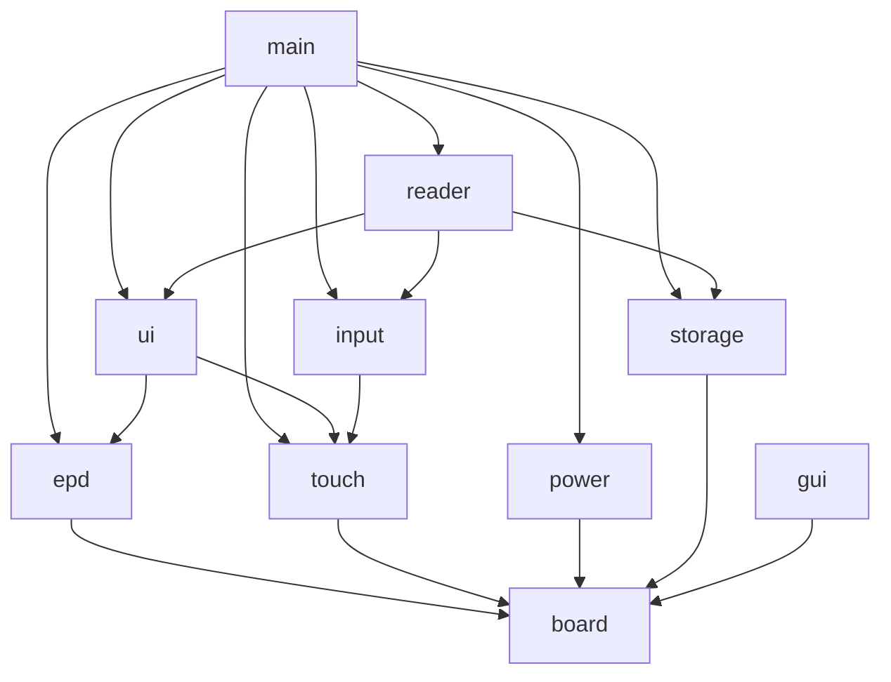

# ESPaperPlay

> 基于 ESP32-S3 的开源电子纸设备开发平台

ESPaperPlay 是一个面向低功耗电子纸应用的嵌入式软件平台。第一阶段目标是
开发一款基于 **ESP32-S3 + 7.5 英寸电子墨水屏** 的低功耗阅读器，同时为
电子书阅读器、桌面信息屏、智能日历、Home Assistant 状态屏、电子标签等
应用预留清晰的扩展点。

当前仓库处于 **软件工程初始化阶段**：已建立模块化、可维护、可扩展的软件
架构骨架，尚未实现具体业务（EPUB/PDF 解析、LVGL 界面、EPD 驱动、网络等）。

---

## 硬件平台

| 模块        | 型号                 | 说明                                    |
| ----------- | -------------------- | --------------------------------------- |
| MCU         | ESP32-S3-WROOM-1-N16R8 | Flash 16MB，PSRAM 8MB                  |
| 显示屏      | 佳显 GDEY075T7-T01   | 7.5"，800x480，UC8179 控制器，SPI 接口  |
| 触摸屏      | GT911                | 电容触摸，I2C + INT + RESET             |
| 存储        | MicroSD              | EPUB / TXT / 图片 / 配置文件             |
| 电源        | 低功耗设计            | ESP32 sleep、外部唤醒、外设断电控制     |

GPIO 与总线默认参数统一在 `components/board/include/espaperplay_config.h`
中定义。

---

## 软件架构

### 目录结构

```
ESPaperPlay
├── main/                  # 系统入口：初始化各模块 + 创建任务（无业务逻辑）
└── components/
    ├── board/             # Board 级硬件抽象：GPIO/SPI/I2C 配置与外设初始化
    ├── drivers/           # 外设驱动层
    │   ├── epd/           # 电子纸抽象层（未来接入 UC8179 驱动）
    │   └── touch/         # GT911 触摸抽象层
    ├── services/          # 系统服务层
    │   ├── input/         # 输入事件管理：触摸 + 物理按键
    │   ├── power/         # 电源管理：sleep / wakeup / 电源域控制
    │   └── storage/       # 存储抽象：SD 卡 + 文件系统
    ├── graphics/          # 图形 / 界面层
    │   └── ui/            # GUI 抽象层（未来接入 LVGL）
    └── applications/      # 应用层
        └── reader/        # 阅读器核心框架（未来支持 TXT/EPUB/PDF）
```

### 分层依赖



* `board` 为最底层硬件抽象，向上提供引脚与总线配置；
* `drivers` 承载外设驱动抽象（epd / touch），`services` 承载系统服务（input / power / storage）；
* `graphics/ui` 与 `applications/reader` 属于应用层框架，为后续业务预留接口；
* 模块之间仅通过公共 API（`espaperplay_xxx()`）通信，禁止直接访问内部变量。

### 命名与日志规范

- 所有公开 API 统一使用 `espaperplay_<模块>_<动作>()` 前缀；
- 日志 TAG 统一为 `ESPaperPlay_<MODULE>`，例如 `ESPaperPlay_EPD`、
  `ESPaperPlay_POWER`；
- 使用 `ESP_LOGI / ESP_LOGW / ESP_LOGE`；
- 所有公共函数带有 Doxygen 注释。

---

## 编译方法

### 环境要求

- ESP-IDF **v6.0.2**（目标芯片 ESP32-S3）
- CMake ≥ 3.22
- 说明：本仓库不安装第三方库，不修改 ESP-IDF 版本。

### 编译

```bash
# 1. 加载 ESP-IDF 环境
. $HOME/esp/esp-idf/export.sh        # 路径以实际安装为准

# 2. 设置目标芯片（首次或切换芯片时）
idf.py set-target esp32s3

# 3. 编译
idf.py build

# 4. 烧录并查看日志
idf.py -p /dev/ttyUSB0 flash monitor
```

首次克隆时，`sdkconfig.defaults`（Flash 16MB / PSRAM 8MB）会自动生效；
如需调整请使用 `idf.py menuconfig`。

### CI

GitHub Actions 在 `.github/workflows/build.yml` 中自动执行 `idf.py build`
（使用 `espressif/idf:v6.0.2` 容器），确保每次提交可编译。

---

## 开发路线

- [ ] **Phase 0（当前）**：软件架构初始化、模块骨架、构建系统与 CI
- [ ] **Phase 1**：Board 驱动（GPIO / SPI / I2C 总线初始化）
- [ ] **Phase 2**：EPD（UC8179）驱动与刷新、GT911 触摸驱动
- [ ] **Phase 3**：低功耗电源管理（sleep / 唤醒 / 电源域）
- [ ] **Phase 4**：SD 卡 + FATFS 文件系统
- [ ] **Phase 5**：LVGL 界面框架
- [ ] **Phase 6**：阅读器（TXT → EPUB → PDF）
- [ ] **Phase 7**：网络与物联网功能（可选）

---

## License

本项目基于 [MIT License](LICENSE) 开源。
