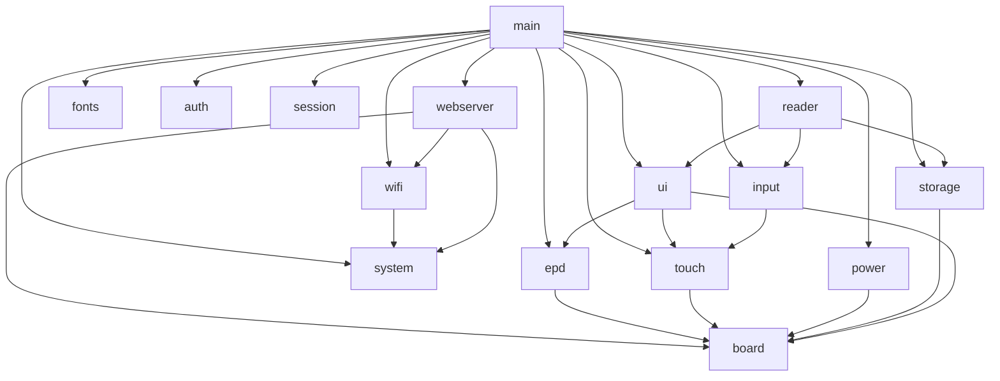

# ESPaperPlay

> An open-source e-paper device development platform built on **ESP32-S3**.
>
> 基于 **ESP32-S3** 的开源电子纸设备开发平台。

<p align="center">
  <a href="#en">English</a> · <a href="#zh">简体中文</a>
</p>

---

<a id="en"></a>
## English

ESPaperPlay is an embedded software platform for low-power e-paper applications. The first milestone is a low-power e-reader built around an **ESP32-S3 + 7.5-inch e-ink display**, while keeping clear extension points for e-book readers, desktop info panels, smart calendars, Home Assistant status screens, e-labels, and more.

The repository is under active development: a modular, maintainable, and extensible architecture is in place. Board drivers (UC8179 EPD, GT911 touch), system config (NVS), WiFi (AP/STA), a Web management console, and net time sync (IP geolocation + NTP) are already implemented; EPUB/PDF parsing and the LVGL UI are planned for later phases.

### Hardware Platform

| Module  | Model                   | Description                                    |
| ------- | ----------------------- | ---------------------------------------------- |
| MCU     | ESP32-S3-WROOM-1-N16R8  | 16MB Flash, 8MB PSRAM                         |
| Display | Good Display GDEY075T7-T01 | 7.5", 800x480, UC8179 controller, SPI      |
| Touch   | GT911                   | Capacitive touch, I2C + INT + RESET            |
| Storage | MicroSD                 | EPUB / TXT / images / config files             |
| Power   | Low-power design        | ESP32 sleep, external wake-up, peripheral power-off control |

Default GPIO and bus parameters are defined centrally in
`components/board/include/espaperplay_config.h`.

### Software Architecture

#### Directory Structure

```
ESPaperPlay
├── main/                  # System entry: init modules + create tasks (no business logic)
└── components/
    ├── board/             # Board-level HW abstraction: GPIO/SPI/I2C config & peripheral init
    ├── drivers/           # Peripheral driver layer
    │   ├── epd/           # E-paper driver (GDEY075T7-T01 / UC8179: full/partial/gray4/fast)
    │   └── touch/         # GT911 touch abstraction
    ├── services/          # System service layer
    │   ├── auth/          # Device auth: secure password storage & verification
    │   ├── clock/         # System clock: timezone (persisted) + NTP sync
    │   ├── geoip/         # IP geolocation via UAPI (uapis.cn), incl. timezone
    │   ├── input/         # Input event management: touch + physical buttons
    │   ├── netip/         # Public IP query via UAPI (uapis.cn)
    │   ├── power/         # Power management: sleep / wakeup / power domains
    │   ├── storage/       # Storage abstraction: SD card + file system
    │   ├── system/        # System config: WiFi mode & credentials persisted to NVS
    │   ├── session/       # Session mgmt: login state, token & rate limiting
    │   ├── wifi/          # WiFi service: AP / STA networking per system config
    │   └── webserver/     # Web console: view status & change settings (esp_https_server)
    ├── graphics/          # Graphics / UI layer
    │   ├── fonts/         # Read-only font assets: fonts partition mmap + LVGL drive 'A:'
    │   └── ui/            # GUI backend (RGB565 framebuffer + mode converters)
    └── applications/      # Application layer
        ├── nettime/       # Net time app: public IP → geolocation → timezone → NTP
        └── reader/        # Reader core framework (TXT/EPUB/PDF to come)
```

#### Layered Dependencies



- `board` is the lowest-level hardware abstraction, providing pin and bus configuration upward;
- `drivers` holds peripheral driver abstractions (epd / touch), while `services` holds system services (auth / clock / geoip / input / netip / power / storage / system / session / wifi / webserver);
- `graphics/ui` and `applications/reader` belong to the application-layer framework and reserve interfaces for future features;
- Modules communicate only through public APIs (`espaperplay_xxx()`); direct access to internal variables is prohibited.

#### EPD Driver (GDEY075T7-T01 / UC8179)

The e-paper driver uses a differential (NEW/OLD plane) architecture: the CDI
`N2OCP` bit makes the controller auto-copy the new plane into the old plane
after every refresh, so no software frame-tracking is needed and partial
updates work on any background. Four refresh modes are exposed through
`espaperplay_epd_refresh()`:

| Mode | Frame format | Notes | Measured (room temp) |
| ---- | ------------ | ----- | -------------------- |
| `FULL` | 1 bpp, 48000 B | OTP fast waveform (force temp 0x5A) | ~1.7 s |
| `PARTIAL` | 1 bpp window (x / width 8-aligned) | PTOUT after DRF (vendor order) | ~0.37 s (80x80), ~0.52 s (full window) |
| `GRAY4` | 2 bpp, 96000 B (0=white ... 3=black) | factory 4-gray waveform, full screen only | — |
| `FAST` | 1 bpp, 48000 B | same waveform as FULL (PLL has no effect on this panel) | ~1.7 s |

Timings are end-to-end `espaperplay_epd_refresh()` durations including
controller (re)initialization; consecutive refreshes in the same mode skip the
re-init, and the driver deep-sleeps the panel automatically when no refresh
arrives for `ESPAPERPLAY_EPD_IDLE_SLEEP_TIMEOUT_MS` (default 30 s, 0 to
disable; refresh always re-initializes on wake). A boot self-test
(`ESPAPERPLAY_EPD_ENABLE_SELFTEST`, off by default) exercises every mode,
prints timings, clears the panel to white and sleeps.

#### GUI Backend (RGB565 + Mode Converters)

The GUI service (`components/graphics/ui`) provides the rendering backend: a
single **RGB565 main framebuffer** (750 KB, PSRAM) is the render target (LVGL
later renders directly into it with `LV_COLOR_DEPTH=16`), and the e-paper's
1bpp / 2bpp constraints are confined to a conversion stage at flush time:

| Mode | Conversion | Refresh |
| ---- | ---------- | ------- |
| Interactive (`BW`) | RGB -> 1bpp: fast threshold or Bayer 4x4 (default; pure black/white bit-exact, no artifacts) | dirty-area partial, ~0.37-0.52 s |
| High-definition (`GRAY4`) | RGB -> 2bpp: Floyd-Steinberg error diffusion (default) or Bayer 4x4 | full screen, ~2.5 s |

Dirty areas are clipped, 8-pixel aligned (X) and merged into one refresh per
frame. Refreshes run **asynchronously on an internal worker task**: flush()
only snapshots (converts) the dirty area and queues it, so renderers (LVGL)
are never blocked by the ~0.4-2.6 s panel update; up to one frame is queued
ahead and later frames merge into it. `espaperplay_gui_wait_idle()` provides
an optional sync point. Page-level switches (`espaperplay_gui_show_ui` /
`show_image`) only change the conversion path — the framebuffer is never
re-rendered — and the driver guarantees clean transitions (gray4 -> BW inverts
the old plane, so residual mid-grays are erased). A self-test
(`ESPAPERPLAY_GUI_ENABLE_SELFTEST`, off by default) exercises both paths and
prints conversion and worker timings.

#### Read-Only Font Assets (fonts Partition)

The fonts service (`components/graphics/fonts`) ships TrueType fonts as
read-only flash assets:

- `assets/fonts/` holds the font files. `NotoSansSC_Regular.ttf` (2.2 MB) is a
  subset of Noto Sans SC covering GB2312 level-1+2 (6763 common CJK glyphs),
  ASCII and common CJK punctuation; regenerate with
  `tools/fonttools-venv/bin/python tools/prepare_font.py` (downloads the
  variable font once into `tools/font_src/`, gitignored).
- At build time `spiffs_create_partition_assets` (from `esp_mmap_assets`)
  packs the directory into a SPIFFS image for the `fonts` partition (8 MB,
  subtype `spiffs`, see `partitions.csv`) and generates
  `mmap_generate_fonts.h` (file index + checksum) into the component build
  dir. `idf.py flash` flashes the partition image automatically.
- At runtime `espaperplay_fonts_init()` (called after LVGL starts) maps the
  partition with `esp_mmap_assets` — font bytes stay in flash, **zero RAM
  copies** — and registers it as LVGL filesystem drive `A:` via `esp_lv_fs`.
  Fonts are then opened as LVGL paths, e.g. `A:NotoSansSC_Regular.ttf`
  (`espaperplay_fonts_get_path()` builds the path).

Note: only file names with `[A-Za-z0-9_]` are allowed — hyphens break the
generated C enum (`MMAP_FONTS_*`); also keep names **shorter than
`CONFIG_MMAP_FILE_NAME_LENGTH` (default 16, set to 32 here)** — an over-long
name is silently truncated at build time (Warn only), and the runtime
`strcmp` lookup then fails so the font cannot be opened (symptom:
`lv_freetype_font_create` returns NULL with no useful FT error).

#### FreeType Font Rendering

Rendering is built on the **LVGL 9.5 FreeType wrapper** (`src/libs/freetype/`,
wrapper only) plus the external
[`espressif/freetype`](https://components.espressif.com/components/espressif/freetype)
component (the real libfreetype 2.14.3, registry dependency):

- Kconfig (`sdkconfig.defaults`): `CONFIG_LV_USE_FREETYPE=y`,
  `CONFIG_LV_FREETYPE_USE_LVGL_PORT=y` (FreeType uses LVGL memory/FS),
  `CONFIG_LV_FREETYPE_CACHE_FT_GLYPH_CNT=256` (glyph cache count),
  `CONFIG_LV_DRAW_THREAD_STACK_SIZE=32768` (glyph rasterization runs on the
  LVGL draw thread; `lv_conf_internal.h` enforces >=32KB at compile time).
- **Link hook** (`components/graphics/fonts/CMakeLists.txt`): when
  `LV_USE_FREETYPE` is on, the lvgl component compiles `src/libs/freetype/*.c`
  which needs the freetype headers and macros, but espressif/freetype is not
  linked into lvgl automatically — the fonts component runs
  `target_link_libraries(lvgl__lvgl PUBLIC idf::espressif__freetype)` and adds
  the global compile definitions `FT_ERR_PREFIX=FT_Err_` /
  `FT_CONFIG_OPTION_ERROR_STRINGS` / `FT2_BUILD_LIBRARY` (same approach as the
  official esp_lvgl_adapter).
- **LVGL filesystem port (critical)**: `LV_FREETYPE_USE_LVGL_PORT` works by
  LVGL's `lv_ftsystem.c` providing strong symbols with the same names as
  freetype's own `ftsystem.c` (`FT_Stream_Open` / `FT_New_Memory` /
  `FT_Done_Memory`, implemented over `lv_fs_open` / `lv_malloc`), overriding
  the ANSI fopen implementation at link time. If freetype's `ftsystem.c` is
  not removed from the freetype target, the linker pulls the ANSI version
  first and the LVGL version becomes dead code, so `fopen("A:xxx.ttf")` fails
  at runtime — the fonts component CMake removes `ftsystem.c` from the
  freetype target and compiles `lv_ftsystem.c` instead (this is what actually
  makes `LV_FREETYPE_USE_LVGL_PORT` take effect; symptom:
  `lv_freetype_font_create` returns NULL with a `FT_New_Face` error log).
- The FreeType engine is initialized automatically by `lv_init()` — no manual
  init call needed.
- **Renderer thread stack**: FreeType glyph rasterization (smooth renderer)
  needs a large stack. This project renders single-threaded
  (`LV_OS_NONE`, no LVGL draw thread), so rasterization runs inside the
  `gui_lvgl` task, whose stack was raised from 8KB to **32KB in PSRAM**
  (`lvgl_port.c`, via `xTaskCreateWithCaps(MALLOC_CAP_SPIRAM)`) — at 8KB,
  rendering a FreeType font on the test screen triggers
  `stack overflow in task gui_lvgl`, and a 32KB internal-RAM stack fails with
  `ESP_ERR_NO_MEM` (WiFi/Web eat the internal heap); note that
  `CONFIG_LV_DRAW_THREAD_STACK_SIZE` has no effect under `LV_OS_NONE`.
- Load API: `espaperplay_fonts_load("NotoSansSC_Regular.ttf", 24, STYLE)` →
  `lv_font_t *` (wraps `lv_freetype_font_create()`, bitmap render mode, small
  4-entry cache keyed by file/size/style), ready for
  `lv_obj_set_style_text_font()`.
- Verification: the UI test screen (`screen_test.c`) renders its title with the
  FreeType font — Chinese glyphs displaying correctly proves the
  mmap-partition → LVGL FS drive → FreeType rasterization chain end to end.
- Size: full libfreetype costs ~+400KB flash (app 2.1MB / 4MB partition, 50% free).

#### Input: Physical Keys & Event Queues

The input service (`components/services/input`) aggregates all human input
sources (physical keys, touch to come) into a unified event stream consumed
through `espaperplay_input_get_event()`.

**Physical key** — the on-board **BOOT button** (GPIO0, active low, internal
pull-up) is driven by the official
[`espressif/button`](https://components.espressif.com/components/espressif/button)
component (v4.2.0, managed dependency). Raw driver events are normalized into
`espaperplay_input_key_action_t`: PRESS_DOWN / PRESS_UP / SINGLE_CLICK /
DOUBLE_CLICK / LONG_PRESS_START / LONG_PRESS_HOLD / LONG_PRESS_UP (with press
duration). `LONG_PRESS_HOLD` is throttled to one event per 500 ms — the driver
default fires every 20 ms, which would flood the event pipeline and make
`LONG_PRESS_UP` get dropped.

**Dual queues (key / touch isolated)** — internally two physical queues are
merged by a FreeRTOS Queue Set:

| Queue | Depth | Policy |
| ----- | ----- | ------ |
| Key | 16 | `xQueueSendToFront` + evict-oldest when full — key events are never lost |
| Touch | 32 | `xQueueSend` drop-newest when full — intermediate points for trajectory drawing are preserved |

`espaperplay_input_get_event()` polls the key queue first (lowest key latency),
then blocks on the Queue Set for either queue. Touch is interrupt-driven
(GT911 INT wakes a task — I2C cannot run in an ISR — which reads coordinates and
posts them to the touch queue), so high-rate touch traffic can never crowd out
key events. Evicting via a direct `xQueueReceive` on a set-member queue is
forbidden: it leaks stale notifications into the set container and eventually
trips the FreeRTOS `prvNotifyQueueSetContainer` assert — the Queue Set is sized
with slack and the touch queue drops incoming events instead of evicting.

**GUI input dispatch** — a dispatcher task (`espaperplay_ui_key_input_start()`)
blocks on the input queue and routes events:

- **Keys** are forwarded one-by-one into the LVGL thread, where the page stack
  routes them to the top page's optional `on_key` hook (extended
  `espaperplay_ui_page_t`). Navigation decisions belong to pages.
- **Touch** updates the LVGL pointer indev state directly (critical-section
  guarded, no LVGL round-trip), so all LVGL widgets respond to touch. Events
  are also batched per ~30 ms window and forwarded to the top page's optional
  `on_touch` hook — every intermediate coordinate survives for trajectory
  drawing.

- Home: single click → push the **Test page**;
- Test page (partial-refresh stress test + live key/touch display): a touch
  pad draws finger trajectories as connected polylines (8 strokes × 512
  points, `clear` button empties the pad, `back` button pops the page through
  the LVGL pointer indev); long-press release → pop back to home.

A boot self-test (`ESPAPERPLAY_UI_ENABLE_KEY_SELFTEST`, off by default) injects
synthetic key events through the real input queue and asserts the page-stack
response (1→2→1→2), printing `key selftest PASS/FAIL`.

#### Network Time: IP Geolocation + NTP Sync

Three independent services, chained at boot by the `nettime` application
(`components/applications/nettime`) once WiFi is up in STA mode:

1. **Public IP** — `netip` service (`components/services/netip`) calls the UAPI
   *Query My IP* endpoint (`GET https://uapis.cn/api/v1/network/myip`) over
   HTTPS (validated with the ESP-IDF built-in CA certificate bundle) and
   returns the device's public egress IP (`espaperplay_netip_query()`).
2. **Geolocation** — `geoip` service (`components/services/geoip`) calls the
   UAPI *Query IP* endpoint (`GET https://uapis.cn/api/v1/network/ipinfo?ip=…`)
   with **the same IP** from step 1 and returns country/province/city, ISP,
   ASN, latitude/longitude and the IANA timezone. It prefers the
   `source=commercial` result (adds the `time_zone` field, e.g.
   `Asia/Shanghai`) and falls back to the standard query automatically
   (`espaperplay_geoip_query()`).
3. **Timezone + NTP** — `clock` service (`components/services/clock`) applies
   the timezone reported by geolocation (`setenv("TZ")` + `tzset()`, persisted
   to NVS so it survives reboots), then starts SNTP through `esp_netif_sntp`
   with three NTP servers (`ntp.aliyun.com`, `cn.pool.ntp.org`,
   `pool.ntp.org`) and waits for the first sync
   (`espaperplay_clock_set_timezone()` / `espaperplay_clock_ntp_start()` /
   `espaperplay_clock_ntp_wait_sync()`).

The three services are fully independent — each can be called standalone with
any IP / timezone; only the `nettime` app wires them together. Requires
`CONFIG_MBEDTLS_CERTIFICATE_BUNDLE=y` (HTTPS) and
`CONFIG_LWIP_SNTP_MAX_SERVERS=3` (multi-server NTP), both preset in
`sdkconfig.defaults`.

**Query caching** — to avoid repeated API calls, both query services cache
results in RAM: `netip` keeps a single entry (the device's own public IP) and
`geoip` keeps the 4 most recent IPs (FIFO eviction). Default TTL is 1 hour;
hits are served without any network request, and caches are only refreshed
after expiry or an explicit `espaperplay_netip_cache_clear()` /
`espaperplay_geoip_cache_clear()`. Adjust with
`espaperplay_netip_set_cache_ttl_ms()` / `espaperplay_geoip_set_cache_ttl_ms()`
(0 disables caching).

#### Weather (QWeather / 和风天气)

The `weather` service (`components/services/weather`) fetches weather data from
the official [QWeather Web API v7](https://dev.qweather.com/docs/api/) over
HTTPS (ESP-IDF CA certificate bundle, authenticated with the `X-QW-Api-Key`
header). It implements:

- **Real-time weather** — `v7/weather/now`;
- **Daily forecast** — `v7/weather/3d` and `v7/weather/7d` (7-day with
  automatic 3-day fallback for subscriptions that do not include it);
- **Hourly forecast** — `v7/weather/24h` (next 24 hours);
- **Minute-level precipitation** — `v7/minutely/5m` (next 2 hours, China
  mainland; the endpoint only accepts "lon,lat" coordinates on the new
  platform, so the service resolves the LocationID back to coordinates via
  GeoAPI before requesting);
- **Weather alerts** — `v7/warning/now`;
- **Weather indices** — `v7/indices/1d` (all types);
- **Air quality** — `v7/air/now` (China mainland);
- **Astronomy** — `v7/astronomy/sun` + `v7/astronomy/moon`
  (sunrise/sunset, moonrise/moonset, moon phase; the endpoints require the
  `date=yyyyMMdd` parameter, filled with the local date; timestamps are
  returned in full ISO form and truncated to `HH:MM` for display);
- **GeoAPI** — city-name / "lon,lat" reverse lookup (default public host
  `geoapi.qweather.com/v2/city/lookup`; with a custom API Host configured the
  new-style `{host}/geo/v2/city/lookup` path is used; a manual LocationID is
  used as-is).

QWeather responses are gzip-compressed by default; the service detects the
gzip magic bytes and decompresses them with the `espressif/zlib` managed
component (see `components/services/weather/idf_component.yml`).

**Configuration** — the API key, an optional location and an optional custom
API Host are persisted in NVS and can be set from the web console (*Weather*
section): `weather_api_key` (required), `weather_location` (optional
LocationID / city name / "lon,lat" like "116.41,39.92" — "lat,lon" is
auto-detected and swapped; empty = auto-locate) and `weather_api_host`
(optional; QWeather is phasing out the public hosts devapi/geoapi.qweather.com
from 2026 — copy your own API Host from the console settings).
Without a manual location the service auto-locates: public IP (`netip`) →
geolocation (`geoip`) → reverse GeoAPI lookup of the coordinates (lon,lat,
2-decimal precision, cached for 24 h).

**Operation** — `espaperplay_weather_start()` runs a background task that
waits for STA connectivity and then refreshes the in-RAM snapshot
(`espaperplay_weather_get_snapshot()`) on a 10-minute cycle. Every API has its
own TTL cache (now/minutely/warnings 10 min, hourly 30 min, daily/air 60 min,
indices/astronomy 6 h) so expired data is fetched independently; the web
console's *Refresh now* button or `espaperplay_weather_request_refresh()`
wakes the task early. Per-API queries (`espaperplay_weather_query_*`) can be
called directly with a location argument or with `NULL` for the configured /
auto-located position. QWeather business codes are surfaced through
`espaperplay_weather_get_status()` (e.g. `401` = invalid key, `403` = quota
exceeded). The weather screen (`screen_weather.c`, long-press on the home
page) displays the snapshot on the e-paper.

#### Naming & Logging Conventions

- All public APIs use the `espaperplay_<module>_<action>()` prefix;
- Log tags follow `ESPaperPlay_<MODULE>`, e.g. `ESPaperPlay_EPD`, `ESPaperPlay_POWER`;
- Use `ESP_LOGI / ESP_LOGW / ESP_LOGE`;
- All public functions are documented with Doxygen comments.

#### Web Console

After boot, a management page is served over **HTTPS** on port **443** of every
network interface (reachable in both AP and STA modes). Plain **HTTP on port
80** is still listened to, but only redirects every request to HTTPS (no
plaintext traffic). The device generates its own P-256 self-signed certificate
on first boot (persisted in NVS, fingerprint stays stable across reboots); the
private key never leaves the device, so it cannot be extracted from the firmware.

| Route                | Method | Description                                       |
| -------------------- | ------ | ------------------------------------------------- |
| `/`                  | GET    | Management page (embedded HTML)                   |
| `/api/status`        | GET    | Runtime status: uptime / heap / firmware / WiFi (auth) |
| `/api/config`        | GET    | Current system config: WiFi mode & credentials (auth) |
| `/api/config`        | POST   | Update config (form-encoded), save & re-apply WiFi (auth) |
| `/api/config/reset`  | POST   | Restore factory defaults & re-apply WiFi (auth)   |
| `/api/wifi/restart`  | POST   | Re-apply WiFi config (auth)                       |
| `/api/system/reboot` | POST   | Reboot the device (auth)                          |
| `/api/auth/status`   | GET    | Login state: authenticated / password configured  |
| `/api/auth/login`    | POST   | Password login, returns a session token           |
| `/api/auth/password` | POST   | Set (first-time) or change password (auth if set) |
| `/api/auth/logout`   | POST   | Revoke the current session                        |
| `/api/weather`       | GET    | Weather service status + data snapshot summary (auth) |
| `/api/weather/refresh` | POST | Request an immediate weather refresh (auth)       |

> AP mode: connect to the device AP from a phone / laptop and browse to
> `http://192.168.4.1/` (it redirects to `https://192.168.4.1/`). Your browser
> will warn about the self-signed certificate — accept the security exception
> once; the certificate SHA-256 fingerprint is printed in the serial log so you
> can verify the connection. On first boot (no password configured yet) the
> console guides you to set a password; afterwards login is required.
> Sensitive APIs (config / wifi / reboot / status) are protected by a bearer
> session token; 5 consecutive login failures trigger a temporary lockout.

### Building

#### Requirements

- ESP-IDF **v6.0.2** (target chip: ESP32-S3)
- CMake ≥ 3.22
- Note: this repo vendors no third-party libraries and does not modify the ESP-IDF version.

#### Build

```bash
# 1. Load the ESP-IDF environment
. $HOME/esp/esp-idf/export.sh        # adjust the path to your installation

# 2. Set the target chip (first time or when switching chips)
idf.py set-target esp32s3

# 3. Build
idf.py build

# 4. Flash and monitor
idf.py -p /dev/ttyUSB0 flash monitor
```

`idf.py flash` flashes the app **and** the `fonts` partition image (built from
`assets/fonts/`, see "Read-Only Font Assets"). For day-to-day iteration use
**`idf.py app-flash`** (app only, no font partition) — run a full `flash` only
after the first clone or whenever `assets/fonts/` changes.

On a fresh clone, `sdkconfig.defaults` (16MB Flash / 8MB PSRAM) is applied automatically; adjust via `idf.py menuconfig` if needed. The defaults enable `-O2` compilation and CPU dynamic frequency scaling (DFS: up to 240 MHz when busy, 80 MHz when idle) to balance performance and power.

#### CI

GitHub Actions runs `idf.py build` automatically in `.github/workflows/build.yml` (using the `espressif/idf:v6.0.2` container) to keep every commit compilable.

### Roadmap

- [x] **Phase 0**: software architecture bootstrap, module skeletons, build system & CI
- [x] **Phase 1**: Board drivers (GPIO / SPI / I2C bus init)
- [x] **Phase 2**: EPD (UC8179) driver & refresh (full / partial / gray4 / fast), GT911 touch driver
- [ ] **Phase 3**: Low-power power management (sleep / wake-up / power domains)
- [ ] **Phase 4**: SD card + FATFS file system
- [ ] **Phase 5**: LVGL UI framework
  - [x] LVGL render backend + page-stack navigation + physical key input
- [ ] **Phase 6**: Reader (TXT → EPUB → PDF)
- [ ] **Phase 7**: Networking & IoT features (optional)
  - [x] Web management console (HTTPS): esp_https_server status & settings
  - [x] Net time sync: public IP → geolocation → timezone → NTP (uapis.cn)

### License

This project is open-sourced under the [MIT License](LICENSE).

---

<a id="zh"></a>
## 简体中文

ESPaperPlay 是一个面向低功耗电子纸应用的嵌入式软件平台。第一阶段目标是
开发一款基于 **ESP32-S3 + 7.5 英寸电子墨水屏** 的低功耗阅读器，同时为
电子书阅读器、桌面信息屏、智能日历、Home Assistant 状态屏、电子标签等
应用预留清晰的扩展点。

当前仓库处于 **积极开发阶段**：已建立模块化、可维护、可扩展的软件架构。
Board 驱动（UC8179 电子纸、GT911 触摸）、系统配置（NVS）、WiFi（AP/STA）、
Web 管理控制台与网络时间同步（IP 定位 + NTP）均已实现；EPUB/PDF 解析与
LVGL 界面将在后续阶段接入。

### 硬件平台

| 模块        | 型号                 | 说明                                    |
| ----------- | -------------------- | --------------------------------------- |
| MCU         | ESP32-S3-WROOM-1-N16R8 | Flash 16MB，PSRAM 8MB                  |
| 显示屏      | 佳显 GDEY075T7-T01   | 7.5"，800x480，UC8179 控制器，SPI 接口  |
| 触摸屏      | GT911                | 电容触摸，I2C + INT + RESET             |
| 存储        | MicroSD              | EPUB / TXT / 图片 / 配置文件             |
| 电源        | 低功耗设计            | ESP32 sleep、外部唤醒、外设断电控制     |

GPIO 与总线默认参数统一在 `components/board/include/espaperplay_config.h`
中定义。

### 软件架构

#### 目录结构

```
ESPaperPlay
├── main/                  # 系统入口：初始化各模块 + 创建任务（无业务逻辑）
└── components/
    ├── board/             # Board 级硬件抽象：GPIO/SPI/I2C 配置与外设初始化
    ├── drivers/           # 外设驱动层
    │   ├── epd/           # 电子纸驱动（GDEY075T7-T01 / UC8179：全刷/局刷/灰阶/快刷）
    │   └── touch/         # GT911 触摸抽象层
    ├── services/          # 系统服务层
    │   ├── auth/          # 设备鉴权：密码安全存储 / 校验 / 更改
    │   ├── clock/         # 系统时钟：时区设置（NVS 持久化）+ NTP 同步
    │   ├── geoip/         # IP 地理位置查询（uapis.cn，含时区）
    │   ├── input/         # 输入事件管理：触摸 + 物理按键
    │   ├── netip/         # 本机公网 IP 查询（uapis.cn）
    │   ├── power/         # 电源管理：sleep / wakeup / 电源域控制
    │   ├── storage/       # 存储抽象：SD 卡 + 文件系统
    │   ├── system/        # 系统配置：WiFi 模式与凭据持久化到 NVS
    │   ├── session/       # 会话管理：登录态、token 与失败限速锁定
    │   ├── wifi/          # WiFi 服务：按系统配置启动 AP / STA 网络
    │   └── webserver/     # Web 管理：状态查看与设置修改（esp_https_server）
    ├── graphics/          # 图形 / 界面层
    │   ├── fonts/         # 只读字体资产：fonts 分区映射 + LVGL 盘符 A:
    │   └── ui/            # GUI 渲染后端（RGB565 帧缓冲 + 模式转换级）
    └── applications/      # 应用层
        ├── nettime/       # 网络时间应用：公网 IP → 地理位置 → 时区 → NTP
        └── reader/        # 阅读器核心框架（未来支持 TXT/EPUB/PDF）
```

#### 分层依赖


- `board` 为最底层硬件抽象，向上提供引脚与总线配置；
- `drivers` 承载外设驱动抽象（epd / touch），`services` 承载系统服务（auth / clock / geoip / input / netip / power / storage / system / session / wifi / webserver）；
- `graphics/ui` 与 `applications/reader` 属于应用层框架，为后续业务预留接口；
- 模块之间仅通过公共 API（`espaperplay_xxx()`）通信，禁止直接访问内部变量。

#### EPD 驱动（GDEY075T7-T01 / UC8179）

电子纸驱动采用差分（新旧平面）架构：CDI 的 `N2OCP` 位使控制器在每次
刷新完成后自动把新平面拷贝到旧平面，无需软件维护"上一帧"，局部刷新可
在任意背景上工作。`espaperplay_epd_refresh()` 提供四种刷新模式：

| 模式 | 帧格式 | 说明 | 实测（室温） |
| ---- | ------ | ---- | ------------ |
| `FULL` | 1bpp 48000B | OTP 快刷波形（强制温度 0x5A） | ~1.7s |
| `PARTIAL` | 1bpp 窗口（x/width 8 对齐） | PTOUT 在 DRF 后（厂商顺序） | ~0.37s（80x80）/ ~0.52s（全屏窗口） |
| `GRAY4` | 2bpp 96000B（0=白…3=黑） | 出厂四灰阶波形，仅全屏 | — |
| `FAST` | 1bpp 48000B | 与 FULL 同波形（PLL 对本面板无效） | ~1.7s |

耗时为 `espaperplay_epd_refresh()` 端到端时长（含控制器初始化）；同模式
连续刷新会跳过重复初始化；驱动在最后一次刷新后超过
`ESPAPERPLAY_EPD_IDLE_SLEEP_TIMEOUT_MS`（默认 30s，0 关闭）无新刷新时
自动深度睡眠（保底，刷新会自动唤醒）。上电自检
（`ESPAPERPLAY_EPD_ENABLE_SELFTEST`，默认关闭）可复验各模式并打印耗时。

#### GUI 渲染后端（RGB565 + 模式转换级）

GUI 服务（`components/graphics/ui`）提供渲染后端：单一 **RGB565 主帧缓冲**
（750KB，PSRAM）作为渲染目标（后续 LVGL 以 `LV_COLOR_DEPTH=16` 直接画入），
电子纸的 1bpp/2bpp 限制全部收敛到 flush 时的转换级：

| 模式 | 转换 | 刷新 |
| ---- | ---- | ---- |
| 交互（`BW`） | RGB->1bpp：快速阈值 或 Bayer 4x4（默认；纯黑/纯白位精确，无伪影） | 脏区局部，~0.37-0.52s |
| 高清（`GRAY4`） | RGB->2bpp：Floyd-Steinberg 误差扩散（默认）或 Bayer 4x4 | 全屏，~2.5s |

脏区自动裁剪、X 方向 8 像素对齐并合并为一帧一次刷新。刷新**异步化**：
flush() 只把脏区快照转换后排队，真实刷新由内部 worker 任务执行（约
0.4-2.6s 的面板更新不阻塞渲染器/LVGL）；最多一帧排队，后续帧合并进待刷帧；
`espaperplay_gui_wait_idle()` 提供可选同步点。页面级切换
（`espaperplay_gui_show_ui` / `show_image`）只改变转换路径、不重渲染主帧；
驱动保证切换刷新干净（灰阶->黑白反相旧平面，清除中间灰残留）。自检
（`ESPAPERPLAY_GUI_ENABLE_SELFTEST`，默认关闭）覆盖两条路径并打印转换与
worker 刷新耗时。

#### 只读字体资产（fonts 分区）

字体服务（`components/graphics/fonts`）把 TrueType 字体作为只读 flash 资产发布：

- `assets/fonts/` 存放字体文件。`NotoSansSC_Regular.ttf`（2.2MB）是 Noto Sans SC
  的子集，覆盖 GB2312 一二级（6763 个常用汉字）+ ASCII + 常用中文标点；
  重新生成：`tools/fonttools-venv/bin/python tools/prepare_font.py`
  （变量字体源文件下载到 `tools/font_src/`，已 gitignore）。
- 构建期由 `spiffs_create_partition_assets`（来自 `esp_mmap_assets` 组件）把目录
  打包为 `fonts` 分区（8MB，`spiffs` 子类型，见 `partitions.csv`）的 SPIFFS 镜像，
  并生成 `mmap_generate_fonts.h`（文件索引 + 校验和）到组件构建目录；
  `idf.py flash` 会自动烧写该分区镜像。
- 运行期 `espaperplay_fonts_init()`（在 LVGL 启动后调用）用 `esp_mmap_assets`
  映射分区——字体字节留在 flash，**零 RAM 拷贝**——并经 `esp_lv_fs` 注册为
  LVGL 文件系统盘符 `A:`。之后以 LVGL 路径打开字体，如
  `A:NotoSansSC_Regular.ttf`（`espaperplay_fonts_get_path()` 可组装路径）。

注意：字体文件名只允许 `[A-Za-z0-9_]`——连字符会破坏生成的 C 枚举名
（`MMAP_FONTS_*`）；且**长度不得超过 `CONFIG_MMAP_FILE_NAME_LENGTH`（默认 16，
本项目已设 32）**——超长文件名构建期仅打 Warn 并静默截断，运行时
`strcmp` 匹配失败导致字体打不开（症状：`lv_freetype_font_create` 返回 NULL，
且 LVGL 日志无 `FT_Stream_Open` 错误以外的线索）。

#### FreeType 字体渲染

字体渲染基于 **LVGL 9.5 FreeType 封装**（`src/libs/freetype/`，仅封装层）+ 外部
[`espressif/freetype`](https://components.espressif.com/components/espressif/freetype)
组件（真正的 libfreetype 2.14.3，registry 依赖）：

- Kconfig（`sdkconfig.defaults`）：`CONFIG_LV_USE_FREETYPE=y`、
  `CONFIG_LV_FREETYPE_USE_LVGL_PORT=y`（FreeType 走 LVGL 内存/文件系统）、
  `CONFIG_LV_FREETYPE_CACHE_FT_GLYPH_CNT=256`（字形缓存数）、
  `CONFIG_LV_DRAW_THREAD_STACK_SIZE=32768`（字形栅格化在 LVGL draw 线程执行，
  `lv_conf_internal.h` 编译期强制 >=32KB）。
- **链接钩子**（`components/graphics/fonts/CMakeLists.txt`）：lvgl 组件编译
  `src/libs/freetype/*.c` 时需要 freetype 头文件与宏，但 espressif/freetype
  不会自动链接进 lvgl——由 fonts 组件执行
  `target_link_libraries(lvgl__lvgl PUBLIC idf::espressif__freetype)` 并追加
  `FT_ERR_PREFIX=FT_Err_` / `FT_CONFIG_OPTION_ERROR_STRINGS` / `FT2_BUILD_LIBRARY`
  全局编译定义（与官方 esp_lvgl_adapter 的做法一致）。
- **LVGL 文件系统移植（关键）**：`LV_FREETYPE_USE_LVGL_PORT` 的机制是 LVGL 的
  `lv_ftsystem.c` 提供与 freetype 自带 `ftsystem.c` 同名的强符号
  `FT_Stream_Open` / `FT_New_Memory` / `FT_Done_Memory`（内部走 `lv_fs_open` /
  `lv_malloc`），链接时覆盖 ANSI fopen 实现。若不清除 freetype 目标中的
  `ftsystem.c`，链接器先拉入 ANSI 版、LVGL 版成为死代码，运行时
  `fopen("A:xxx.ttf")` 必然失败——fonts 组件的 CMake 会从 freetype 目标剔除
  `ftsystem.c` 并编入 `lv_ftsystem.c`（即 `LV_FREETYPE_USE_LVGL_PORT` 生效的
  真正开关；症状：`lv_freetype_font_create` 返回 NULL，日志
  `FT_New_Face ... error`）。
- FreeType 引擎由 `lv_init()` 自动初始化（无需手动调用）。
- **渲染线程栈**：FreeType 字形栅格化（smooth 渲染器）消耗大栈。本项目是
  LVGL 单线程渲染模式（`LV_OS_NONE`，无独立 draw 线程），渲染发生在
  `gui_lvgl` 任务内，其栈已从 8KB 提升到 **32KB 且放在 PSRAM**
  （`lvgl_port.c` 用 `xTaskCreateWithCaps(MALLOC_CAP_SPIRAM)`）——8KB 时渲染
  FreeType 字体会触发 `stack overflow in task gui_lvgl`，32KB 放内部 RAM 又会
  `xTaskCreate` 返回 `ESP_ERR_NO_MEM`（WiFi/Web 占用内部堆）；
  （注意 `CONFIG_LV_DRAW_THREAD_STACK_SIZE` 在 `LV_OS_NONE` 下不生效）。
- 加载 API：`espaperplay_fonts_load("NotoSansSC_Regular.ttf", 24, STYLE)` →
  `lv_font_t *`（内部走 `lv_freetype_font_create()`，位图渲染模式，按
  文件名/字号/样式做 4 项小型缓存），可直接
  `lv_obj_set_style_text_font()` 使用。
- 验证：UI 测试页（`screen_test.c`）标题用 FreeType 字体渲染
  「UI Test · FreeType 字体渲染正常」——中文正常显示即证明
  mmap 分区 → LVGL FS 盘符 → FreeType 栅格化链路可用。
- 体积：libfreetype 全量链接约 +400KB flash（app 2.1MB / 4MB 分区，余 50%）。

#### 输入：物理按键与事件队列

输入服务（`components/services/input`）把人机输入源（物理按键、未来触摸）
聚合为统一事件流，通过 `espaperplay_input_get_event()` 消费。

**物理按键** —— 板载 **BOOT 键**（GPIO0，按下低电平，内部上拉）由官方
[`espressif/button`](https://components.espressif.com/components/espressif/button)
组件（v4.2.0，组件管理器依赖）驱动，原始事件归一化为
`espaperplay_input_key_action_t`：PRESS_DOWN / PRESS_UP / SINGLE_CLICK /
DOUBLE_CLICK / LONG_PRESS_START / LONG_PRESS_HOLD / LONG_PRESS_UP（含按压
时长）。`LONG_PRESS_HOLD` 节流为每 500ms 一个——驱动默认每 20ms 触发一次，
会洪泛事件管道并导致 LONG_PRESS_UP 漏检。

**双队列（按键 / 触摸隔离）** —— 内部为两个物理队列，经 FreeRTOS Queue Set
合并消费：

| 队列 | 深度 | 满时策略 |
| ---- | ---- | -------- |
| 按键 | 16 | 队首投递 + 挤掉最旧——按键事件永不丢失 |
| 触摸 | 32 | `xQueueSend` 满时丢新——保留中间点供轨迹绘制 |

`espaperplay_input_get_event()` 优先非阻塞查按键队列（按键延迟最低），再
阻塞等待 Queue Set 中任一队列。触摸采用中断驱动（GT911 INT 唤醒任务——
I2C 不能在 ISR 中执行——任务读取坐标后投递触摸队列），高频触摸流量不会
挤占按键队列。禁止对 Queue Set 成员队列直接 `xQueueReceive` 挤旧：会在
容器中留下陈旧通知，最终触发 FreeRTOS `prvNotifyQueueSetContainer`
断言崩溃——Queue Set 容器带余量创建，触摸队列满时改为丢弃新事件。

**GUI 输入分发** —— 分发任务（`espaperplay_ui_key_input_start()`）阻塞读取
输入队列，按键 / 触摸分路处理：

- **按键**：逐个投递到 LVGL 线程，由页面栈转发给栈顶页面的可选 `on_key`
  钩子（`espaperplay_ui_page_t` 扩展）。导航决策属于页面；
- **触摸**：直接更新 LVGL 指针 indev 状态（临界区保护、无 LVGL 往返延迟），
  所有 LVGL 控件均响应触摸；事件同时按 ~30ms 窗口批量投递、逐条转发给
  栈顶页面的可选 `on_touch` 钩子——全部中间坐标保留，供轨迹绘制。

- 主页：单击 → 进入**测试页**；
- 测试页（局刷压力测试 + 按键/触摸实时显示）：触摸画板把手指轨迹画成
  连续折线（8 笔 × 512 点，`clear` 按钮清空画板，`back` 按钮经 LVGL 指针
  indev 点击返回）；长按松开 → 返回主页。

上电自检（`ESPAPERPLAY_UI_ENABLE_KEY_SELFTEST`，默认关闭）通过真实输入队列
注入合成按键事件，断言页面栈响应（1→2→1→2），输出
`key selftest PASS/FAIL`。

#### 网络时间：IP 定位 + NTP 同步

三个相互独立的服务，由 `nettime` 应用（`components/applications/nettime`）
在 WiFi 以 STA 模式联网后串联执行：

1. **获取本机公网 IP** —— `netip` 服务（`components/services/netip`）调用
   UAPI「查询我的 IP」接口（`GET https://uapis.cn/api/v1/network/myip`），
   HTTPS 请求（使用 ESP-IDF 内置 CA 证书包校验服务器证书），返回设备出口
   公网 IP（`espaperplay_netip_query()`）。
2. **相同 IP 查询地理位置** —— `geoip` 服务（`components/services/geoip`）
   用**第 1 步得到的同一个 IP** 调用 UAPI「IP 查询」接口
   （`GET https://uapis.cn/api/v1/network/ipinfo?ip=…`），返回国家 / 省份 /
   城市、运营商、ASN、经纬度与 IANA 时区。优先使用 `source=commercial`
   商业级查询（附带 `time_zone` 字段，如 `Asia/Shanghai`），失败时自动回退
   标准查询（`espaperplay_geoip_query()`）。
3. **设置时区 + NTP 同步** —— `clock` 服务（`components/services/clock`）
   应用地理位置返回的时区（`setenv("TZ")` + `tzset()`，持久化到 NVS，
   重启后自动恢复），再通过 `esp_netif_sntp` 启动 SNTP，默认配置三个 NTP
   服务器（`ntp.aliyun.com`、`cn.pool.ntp.org`、`pool.ntp.org`）并等待首次
   同步完成（`espaperplay_clock_set_timezone()` /
   `espaperplay_clock_ntp_start()` / `espaperplay_clock_ntp_wait_sync()`）。

三个服务彼此独立、可单独调用（可传入任意 IP / 时区），仅由 `nettime`
应用负责编排串联。依赖 `CONFIG_MBEDTLS_CERTIFICATE_BUNDLE=y`（HTTPS）与
`CONFIG_LWIP_SNTP_MAX_SERVERS=3`（多服务器 NTP），两者已写入
`sdkconfig.defaults`。

**查询缓存** —— 为避免重复请求，两个查询服务均把结果缓存在内存中：
`netip` 缓存单条（设备自身公网 IP），`geoip` 缓存最近查询的 4 个 IP
（满时淘汰最旧）。默认有效期 1 小时，命中时直接返回缓存、不发网络请求，
仅过期或调用 `espaperplay_netip_cache_clear()` /
`espaperplay_geoip_cache_clear()` 后强制重新查询；有效期可通过
`espaperplay_netip_set_cache_ttl_ms()` / `espaperplay_geoip_set_cache_ttl_ms()`
调整（设为 0 禁用缓存）。

#### 天气（和风天气 QWeather）

`weather` 服务（`components/services/weather`）通过官方
[和风天气 Web API v7](https://dev.qweather.com/docs/api/)（HTTPS + ESP-IDF
内置 CA 证书包校验，`X-QW-Api-Key` 请求头认证）获取天气数据，实现：

- **实时天气** —— `v7/weather/now`；
- **逐日天气预报** —— `v7/weather/3d` 与 `v7/weather/7d`（7 日预报失败时
  自动回退 3 日，适配不含 7 日预报的订阅）；
- **逐小时预报** —— `v7/weather/24h`（未来 24 小时）；
- **分钟级降水** —— `v7/minutely/5m`（未来 2 小时逐分钟降水强度，
  仅中国大陆；新平台该接口只接受"经度,纬度"坐标，服务会自动把
  LocationID 经 GeoAPI 反查为坐标后再请求）；
- **气象灾害预警** —— `v7/warning/now`；
- **天气指数** —— `v7/indices/1d`（全部类型）；
- **空气质量** —— `v7/air/now`（仅中国大陆）；
- **天文** —— `v7/astronomy/sun` + `v7/astronomy/moon`（日出日落、
  月升月落、月相；接口必选 `date=yyyyMMdd` 参数，自动填本地当天日期；
  返回时间为完整时间戳，展示时截取 `HH:MM`）；
- **GeoAPI 城市查询** —— 城市名 / "经度,纬度" 反查 LocationID（默认公共地址
  `geoapi.qweather.com/v2/city/lookup`；配置自定义 API Host 后使用
  `{host}/geo/v2/city/lookup`）。

和风天气 API 默认以 gzip 压缩响应，服务检测到 gzip 魔数后用
`espressif/zlib` 托管组件解压（见 `components/services/weather/idf_component.yml`）。

**配置** —— API Key 与可选位置持久化在 NVS，可在 Web 管理控制台「天气
设置」区配置：`weather_api_key`（必填）、`weather_location`（可选
LocationID / 城市名 / "经度,纬度"，如 "116.41,39.92"；按习惯写
"纬度,经度" 会自动交换；留空 = 自动定位）与 `weather_api_host`（可选；
和风天气 2026 年起逐步停止公共地址 devapi/geoapi.qweather.com，建议在
控制台-设置获取自己的 API Host 填入）。未配置位置时服务自动定位：公网
IP（`netip`）→ 地理位置（`geoip`）→ GeoAPI 经纬度反查 LocationID
（结果缓存 24 小时）。

**运行** —— `espaperplay_weather_start()` 启动后台任务：等待 STA 联网后
每 10 分钟把全部数据刷新进内存快照（`espaperplay_weather_get_snapshot()`）。
各接口拥有独立 TTL 缓存（实时 / 分钟级 / 预警 10 分钟、逐小时 30 分钟、
预报 / 空气 60 分钟、指数 / 天文 6 小时），按需单独过期；管理页「立即
刷新」按钮或 `espaperplay_weather_request_refresh()` 可提前唤醒任务。
单项查询 `espaperplay_weather_query_*()` 可直接传入位置或传 NULL 使用
配置 / 自动定位位置。QWeather 业务码通过 `espaperplay_weather_get_status()`
对外暴露（如 401 = Key 无效、403 = 配额超限）。主界面长按进入天气页
（`screen_weather.c`），在电子纸上展示快照数据。

#### 命名与日志规范

- 所有公开 API 统一使用 `espaperplay_<模块>_<动作>()` 前缀；
- 日志 TAG 统一为 `ESPaperPlay_<MODULE>`，例如 `ESPaperPlay_EPD`、
  `ESPaperPlay_POWER`；
- 使用 `ESP_LOGI / ESP_LOGW / ESP_LOGE`；
- 所有公共函数带有 Doxygen 注释。

#### Web 管理控制台

设备启动后会在**所有网络接口的 443 端口**以 **HTTPS** 提供管理页面（AP 与
STA 模式下均可访问）。**80 端口**仍会监听，但仅把所有请求 302 重定向到
HTTPS，杜绝明文流量。设备在首次启动时自行生成 P-256 自签名证书（持久化于
NVS，重启后指纹不变），私钥永不出设备，无法从固件中提取。

| 路由                  | 方法  | 说明                                        |
| --------------------- | ----- | ------------------------------------------- |
| `/`                   | GET   | 管理页面（嵌入式 HTML）                     |
| `/api/status`         | GET   | 运行状态：运行时间 / 堆 / 固件 / WiFi 等（需登录）|
| `/api/config`         | GET   | 当前系统配置：WiFi 模式与凭据（需登录）           |
| `/api/config`         | POST  | 更新配置（表单编码），保存并重新应用 WiFi（需登录）|
| `/api/config/reset`   | POST  | 恢复出厂默认配置并重新应用 WiFi（需登录）         |
| `/api/wifi/restart`   | POST  | 重新应用 WiFi 配置（需登录）                      |
| `/api/system/reboot`  | POST  | 重启设备（需登录）                                |
| `/api/auth/status`    | GET   | 登录状态：是否已登录 / 是否已设置密码              |
| `/api/auth/login`     | POST  | 密码登录，成功后返回会话 token                    |
| `/api/auth/password`  | POST  | 首次设置 / 修改密码（已设置后需登录）              |
| `/api/auth/logout`    | POST  | 吊销当前会话                                      |
| `/api/weather`        | GET   | 天气服务状态与数据快照摘要（需登录）                |
| `/api/weather/refresh`| POST  | 请求立即刷新天气数据（需登录）                      |

> AP 模式下用手机 / 电脑连接设备热点，浏览器访问 `http://192.168.4.1/`
>（会自动重定向到 `https://192.168.4.1/`）。浏览器会对自签名证书给出安全
> 警告，首次访问需手动信任一次；证书 SHA-256 指纹会打印在串口日志中，可据
> 此核对连接真实性。设备出厂未设置密码时，页面会引导首次设置密码；
> 设置后访问需登录。
> 配置 / WiFi / 重启 / 状态等敏感接口由会话 token 鉴权保护，连续 5 次登录
> 失败会触发临时锁定。

### 编译方法

#### 环境要求

- ESP-IDF **v6.0.2**（目标芯片 ESP32-S3）
- CMake ≥ 3.22
- 说明：本仓库不安装第三方库，不修改 ESP-IDF 版本。

#### 编译

```bash
# 1. 加载 ESP-IDF 环境
. $HOME/esp/esp-idf/export.sh        # 路径以实际安装为准

# 2. 设置目标芯片（首次或切换芯片时）
idf.py set-target esp32s3

# 3. 编译
idf.py build

# 4. 烧录并查看日志
idf.py -p /dev/ttyUSB0 flash monitor
```

`idf.py flash` 会同时烧录 app **和** `fonts` 字体分区镜像（由
`assets/fonts/` 构建，见"只读字体资产"）。日常迭代建议用
**`idf.py app-flash`**（只烧 app，不烧字体分区）；首次克隆或
`assets/fonts/` 内容变更后再执行完整 `flash`。

首次克隆时，`sdkconfig.defaults`（Flash 16MB / PSRAM 8MB）会自动生效；
如需调整请使用 `idf.py menuconfig`。默认配置已启用 `-O2` 编译优化与 CPU
动态调频（DFS：繁忙升至 240MHz，空闲降至 80MHz），平衡性能与功耗。

#### CI

GitHub Actions 在 `.github/workflows/build.yml` 中自动执行 `idf.py build`
（使用 `espressif/idf:v6.0.2` 容器），确保每次提交可编译。

### 开发路线

- [x] **Phase 0**：软件架构初始化、模块骨架、构建系统与 CI
- [x] **Phase 1**：Board 驱动（GPIO / SPI / I2C 总线初始化）
- [x] **Phase 2**：EPD（UC8179）驱动与刷新（全刷/局刷/灰阶/快刷）、GT911 触摸驱动
- [ ] **Phase 3**：低功耗电源管理（sleep / 唤醒 / 电源域）
- [ ] **Phase 4**：SD 卡 + FATFS 文件系统
- [ ] **Phase 5**：LVGL 界面框架
  - [x] LVGL 渲染后端 + 页面栈导航 + 物理按键输入
- [ ] **Phase 6**：阅读器（TXT → EPUB → PDF）
- [ ] **Phase 7**：网络与物联网功能（可选）
  - [x] Web 管理控制台（HTTPS）：esp_https_server 状态查看与设置
  - [x] 网络时间同步：公网 IP → 地理位置 → 时区 → NTP（uapis.cn）

### License

本项目基于 [MIT License](LICENSE) 开源。
