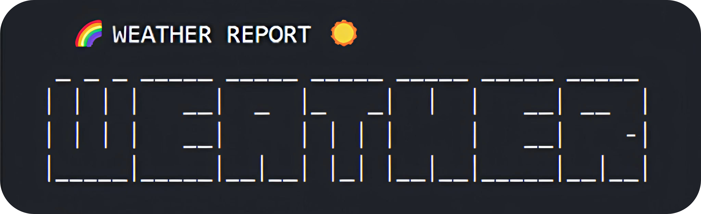

<h1 align="center">🌦️ ESP32 Weather Component</h1>

<p align="center">
A cool component that turns ESP32 into a smart weather station<br/>
Supports three weather APIs: AMap, Seniverse, and HeFeng<br/>
Provides weather information retrieval and display functionality
</p>

<p align="center">
 English
· <a href="./README.md">简体中文</a>
· <a href="https://github.com/NingZiXi/weather/releases">Changelog</a>
· <a href="https://github.com/NingZiXi/weather/issues">Report Issues</a>
</p>

<p align="center">
  <a href="LICENSE">
    
  </a>
  <a href="https://docs.espressif.com/projects/esp-idf/">
    
  </a>
  <a href="https://www.espressif.com/">
    
  </a>
  <a href="">
    
  </a>
  <a href="https://github.com/NingZiXi/weather/stargazers">
    
  </a>"
  </a>
</p>

---

✨ A cool component that turns ESP32 into a smart weather station ✨  
## 🚀 Key Features

- 🌐 **Three-in-One API Support**: AMap, Seniverse, and HeFeng Weather APIs to choose from  
- 📍 **Smart Location**: Automatically detects your location, no manual configuration needed  
- 🔍 **Rich Data**: Temperature, humidity, wind speed, precipitation... everything you need  
- 🎨 **Terminal Beautification**: Console output as beautiful as artwork  
- 🔒 **Secure & Reliable**: HTTPS + CRT certificate verification  

## 📊 Data Support Comparison

| Feature          | AMap Weather | Seniverse Weather | HeFeng Weather |
|------------------|--------------|-------------------|----------------|
| Real-time Weather| ✅            | ✅                 | ✅              |
| Temperature      | ✅            | ✅                 | ✅              |
| Humidity         | ✅            | ❌                 | ✅              |
| Wind Direction & Speed | ✅ | ❌        | ✅              |
| Wind Force       | ✅            | ❌                 | ✅              |
| Atmospheric Pressure | ❌      | ❌                 | ✅              |
| Visibility       | ❌            | ❌                 | ✅              |
| Feels Like       | ❌            | ❌                 | ✅              |
| Precipitation    | ❌            | ❌                 | ✅              |
| Cloud Cover      | ❌            | ❌                 | ✅              |
| Dew Point        | ❌            | ❌                 | ✅              |
| Free API Calls   | 300K/day     | Unlimited          | 1000/day       |
| Paid Plans       | Optional     | Optional           | Optional       |

The above data is based on free services. HeFeng Weather is recommended here. Although it has fewer free calls, the free service is the same as the paid version.

## 🛠️ Quick Start

### 1. Clone the Project

To add the component to your project, execute the following command in the IDF terminal:

```bash
idf.py add-dependency "ningzixi/weather^1.1.0"
```

Or clone this repository directly into the `components` directory of your project:

```bash
git clone https://github.com/NingZiXi/weather
```

### 2. Obtain API Keys

- **AMap API**: [https://lbs.amap.com/api/webservice/guide/create-project/get-key](https://lbs.amap.com/api/webservice/guide/create-project/get-key)  
- **Seniverse API**: [https://www.seniverse.com/dashboard](https://www.seniverse.com/dashboard)  
- **HeFeng API**: In addition to obtaining the key, you also need to configure the host for HeFeng Weather:  
  - Key: [https://console.qweather.com/home](https://console.qweather.com/home)  
  - Host: [https://console.qweather.com/setting](https://console.qweather.com/setting)  

### 3. Basic Usage

```c
#include "weather.h"

void app_main() {
    // Omit the networking part
    weather_config_t config = {
        .api_key = WEATHER_HEFENG_KEY,
        .api_host = WEATHER_HEFENG_HOSE,    // HeFeng Weather requires host configuration
        .city = NULL, // If city is NULL, the location is automatically detected based on IP. You can also specify a city.
        // .city = "Beijing",
        .type = WEATHER_HEFENG  // Can be changed to WEATHER_AMAP or WEATHER_XINZHI for other APIs
    };

    weather_info_t *info = weather_get(&config);
    if (info) {
        weather_print_info(info); // Print weather information
        weather_info_free(info);
    }
}
```
For more API interfaces, please refer to [weather.h](include/weather.h).

#### Serial Output Example:
``` 
  🌈 WEATHER REPORT ☁️
 _ _ _ _____ _____ _____ _____ _____ _____
| | | |   __|  _  |_   _|  |  |   __| __  |
| | | |   __|     | | | |     |   __|    -|
|_____|_____|__|__| |_| |__|__|_____|__|__|

📍 Location: Newyork
┌───────────────────────────────────────┐
│ ☁️  Weather: Cloudy                  │
│ 🌡️  Temperature: 30.0℃              │
│ 🤒  Feels Like: 25.0℃               │
│ 💧  Humidity: 21.0%                  │
│ 🍃  Wind Direction: Southwest        │
│ 💨  Wind Force: 5                    │
│ 🌬️  Wind Speed: 29.0km/h             │
│ ⏲️  Pressure: 1004.0hPa              │
│ 👁️  Visibility: 26.0km               │
│ ☁️  Cloud Cover: 99.0%               │
│ 💦  Dew Point: 10.0℃                │
└───────────────────────────────────────┘

🕒 Update Time: 2025-04-16T14:18+08:00
```

## Contribution
This project is licensed under the MIT License. For details, please refer to the [LICENSE](LICENSE) file. This project is still under development, and some features may not be fully implemented or may contain bugs. If you encounter any issues during use, feel free to contact the author or submit an Issue to help improve this project!

<p align="center">
Thank you for using the ESP32 Weather Component!<br/>
If you like the project, please give it a ⭐ Star to show your support!
</p>