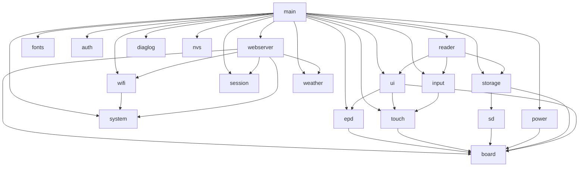

# Architecture · 软件架构

> [← Back to README](../README.md) · ESPaperPlay documentation
>
> [← 返回 README](../README.md) · ESPaperPlay 项目文档

<p align="center">
  <a href="#en">English</a> · <a href="#zh">简体中文</a>
</p>

---

<a id="en"></a>
## English

### Directory Structure

```
ESPaperPlay
├── main/                  # System entry: init modules + create tasks (no business logic)
├── assets/fonts/          # Font sources packed into the read-only fonts partition
├── tools/                 # Asset generators (font subsetting, Iconify/QWeather icons)
└── components/
    ├── board/             # Board-level HW abstraction: GPIO/SPI/I2C config & peripheral init
    ├── drivers/           # Peripheral driver layer
    │   ├── epd/           # E-paper driver (GDEY075T7-T01 / UC8179: full/partial/gray4/fast)
    │   ├── touch/         # GT911 touch abstraction + health self-healing
    │   └── sd/            # MicroSD driver (SDIO/SDMMC: host/slot/card + block I/O)
    ├── services/          # System service layer
    │   ├── auth/          # Device auth: secure password storage & verification
    │   ├── clock/         # System clock: timezone (persisted) + NTP sync
    │   ├── diaglog/       # SD diagnostic log: stack-safe writes + lifecycle timeline
    │   ├── geoip/         # IP geolocation via UAPI (uapis.cn), incl. timezone
    │   ├── input/         # Input event management: touch + physical buttons + activity tracking
    │   ├── netip/         # Public IP query via UAPI (uapis.cn)
    │   ├── nvs/           # NVS convenience wrapper (key-value persistence)
    │   ├── power/         # Power mgmt: auto light sleep / wakeup / periodic timer wake
    │   ├── session/       # Session mgmt: login state, token & rate limiting
    │   ├── storage/       # Storage abstraction: SD card + FATFS + VFS
    │   ├── system/        # System config persisted to NVS (WiFi / settings / font selection)
    │   ├── weather/       # QWeather client: now / 24h / 7d / minutely / alerts / indices / air / astronomy
    │   ├── wifi/          # WiFi service: AP / STA, network scanning, per system config
    │   └── webserver/     # Web console: status / settings / files / fonts / wizard (esp_https_server)
    ├── graphics/          # Graphics / UI layer
    │   ├── fonts/         # Font assets: fonts partition mmap (drive A:) + SD full font (drive B:)
    │   └── ui/            # LVGL backend (RGB565 framebuffer + mode converters) + status bar
    │       └── screens/   # boot / home / weather / reader / reader_home / files /
    │                      # settings / setup / wifi_list / test
    └── applications/      # Application layer
        ├── nettime/       # Net time app: public IP → geolocation → timezone → NTP
        └── reader/        # Reader: TXT/EPUB parsing, block model, pagination, history
            └── src/libs/  # Vendored TJpgDec (streaming JPEG decode for EPUB)
```

### Layered Dependencies



- `board` is the lowest-level hardware abstraction, providing pin and bus configuration upward;
- `drivers` holds peripheral driver abstractions (epd / touch / sd), while `services` holds system services (auth / clock / diaglog / geoip / input / netip / nvs / power / session / storage / system / weather / wifi / webserver);
- `graphics/ui` and `applications/reader` belong to the application-layer framework;
- Modules communicate only through public APIs (`espaperplay_xxx()`); direct access to internal variables is prohibited.

### Naming & Logging Conventions

- All public APIs use the `espaperplay_<module>_<action>()` prefix;
- Log tags follow `ESPaperPlay_<MODULE>`, e.g. `ESPaperPlay_EPD`, `ESPaperPlay_POWER`;
- Use `ESP_LOGI / ESP_LOGW / ESP_LOGE`;
- All public functions are documented with Doxygen comments.

---

<a id="zh"></a>
## 简体中文

### 目录结构

```
ESPaperPlay
├── main/                  # 系统入口：初始化各模块 + 创建任务（无业务逻辑）
├── assets/fonts/          # 字体源文件（打包进只读 fonts 分区）
├── tools/                 # 资产生成脚本（字体子集、Iconify/和风图标）
└── components/
    ├── board/             # Board 级硬件抽象：GPIO/SPI/I2C 配置与外设初始化
    ├── drivers/           # 外设驱动层
    │   ├── epd/           # 电子纸驱动（GDEY075T7-T01 / UC8179：全刷/局刷/灰阶/快刷）
    │   ├── touch/         # GT911 触摸抽象层 + 健康自愈
    │   └── sd/            # MicroSD 驱动（SDIO/SDMMC：主机/槽位/卡片 + 块读写）
    ├── services/          # 系统服务层
    │   ├── auth/          # 设备鉴权：密码安全存储 / 校验 / 更改
    │   ├── clock/         # 系统时钟：时区设置（NVS 持久化）+ NTP 同步
    │   ├── diaglog/       # SD 诊断日志：小栈安全写入 + 生命周期时间线
    │   ├── geoip/         # IP 地理位置查询（uapis.cn，含时区）
    │   ├── input/         # 输入事件管理：触摸 + 物理按键 + 用户活动追踪
    │   ├── netip/         # 本机公网 IP 查询（uapis.cn）
    │   ├── nvs/           # NVS 便捷封装（键值持久化）
    │   ├── power/         # 电源管理：自动浅睡眠 / 唤醒 / 定时器周期唤醒
    │   ├── session/       # 会话管理：登录态、token 与失败限速锁定
    │   ├── storage/       # 存储抽象：SD 卡 + FATFS + VFS
    │   ├── system/        # 系统配置持久化（NVS）：WiFi / 设置项 / 字体选用
    │   ├── weather/       # 和风天气客户端：实时/24h/7d/分钟级/预警/指数/空气/天文
    │   ├── wifi/          # WiFi 服务：AP / STA、网络扫描，按系统配置启动
    │   └── webserver/     # Web 管理：状态 / 设置 / 文件 / 字体 / 引导向导（esp_https_server）
    ├── graphics/          # 图形 / 界面层
    │   ├── fonts/         # 字体资产：fonts 分区映射（盘符 A:）+ SD 完整字库（盘符 B:）
    │   └── ui/            # LVGL 后端（RGB565 帧缓冲 + 模式转换级）+ 统一状态栏
    │       └── screens/   # boot / home / weather / reader / reader_home / files /
    │                      # settings / setup / wifi_list / test
    └── applications/      # 应用层
        ├── nettime/       # 网络时间应用：公网 IP → 地理位置 → 时区 → NTP
        └── reader/        # 阅读器：TXT/EPUB 解析、块模型、分页、阅读历史
            └── src/libs/  # 自持 TJpgDec（EPUB JPEG 流式解码）
```

### 分层依赖


- `board` 为最底层硬件抽象，向上提供引脚与总线配置；
- `drivers` 承载外设驱动抽象（epd / touch / sd），`services` 承载系统服务（auth / clock / diaglog / geoip / input / netip / nvs / power / session / storage / system / weather / wifi / webserver）；
- `graphics/ui` 与 `applications/reader` 属于应用层框架；
- 模块之间仅通过公共 API（`espaperplay_xxx()`）通信，禁止直接访问内部变量。

### 命名与日志规范

- 所有公开 API 统一使用 `espaperplay_<模块>_<动作>()` 前缀；
- 日志 TAG 统一为 `ESPaperPlay_<MODULE>`，例如 `ESPaperPlay_EPD`、
  `ESPaperPlay_POWER`；
- 使用 `ESP_LOGI / ESP_LOGW / ESP_LOGE`；
- 所有公共函数带有 Doxygen 注释。
